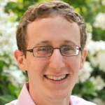
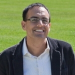
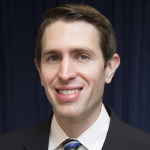
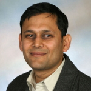
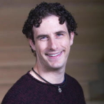

- - -

## Workshop Home

The first workshop on **Mechanism Design for Social Good** (MD4SG '17) will be held in conjunction with the [18th ACM Conference on Economics and Computation (EC '17)](http://sigecom.org/ec17/) at MIT in Cambridge, MA on June 26, 2017, and will feature invited speakers, paper presentations, and a panel discussion with researchers in the EconCS community.

**Synopsis:** The EC community has made great contributions both to the development of theoretical foundations and applications of mechanism design. Key application domains have so far included ad auctions and electronic commerce, cloud computing, fair division, kidney donation, and school choice. In this workshop, we will focus on a set of promising applications of mechanism design that deal with _access to opportunity_ including low-income housing, refugee resettlement, healthcare, and education. In each of these domains, the government and citizens design allocation policies, impose tax structures, create laws, and regulate activities. These are all mechanism design problems with the unifying property that progress has the potential to significantly improve societal welfare.

The workshop will have three main components:
*   Invited talks from domain experts in fields such as public policy and economics.
*   Presentations of submitted papers by members of the EC community.
*   A panel of researchers with experience applying theoretical insights to areas with social good objectives.

The goal of this workshop is fourfold:
1.  Expose the EC community to new research directions through invited talks.
2.  Engage the workshop attendees with domain experts to foster future learning and collaboration opportunities.
3.  Jointly brainstorm and formalize research problems that the community can work on.
4.  Highlight existing work in the community that falls under this theme.

More generally, we see this workshop as part of a broader goal to create and raise interest in different mechanism design problems with a social good objective.

**Organizers:** [Rediet Abebe](http://www.cs.cornell.edu/~red/) and [Kira Goldner](http://homes.cs.washington.edu/~kgoldner/)  
**Contact:** [organizers@md4sg.com](mailto:organizers@md4sg.com)

- - -

## Call for Papers

The 1st Workshop on Mechanism Design for Social Good will be taking place at this year's ACM Conference on Economics and Computation at MIT on June 26, 2017. The goal of this workshop is to understand domains where tools from mechanism design have the potential to impact social good. During this year's workshop we will focus on mechanisms that _improve access to opportunity_. We aim to highlight domains that have been relatively unexplored by the EconCS community. We invite paper submissions broadly related to these themes, including theoretical and applied mechanism design work as well as empirical research that suggests future directions for mechanism design in these domains.  
  
Topics of interest for this workshop include but **are not limited to**:
*   allocating low-income housing
*   allocating health insurance funds, managing access to healthcare, and pricing medical treatments
*   work on health insurance markets that highlights market design issues
*   redistributive mechanisms to mitigate economic inequality
*   understanding and increasing intergenerational mobility
*   mitigating unequal economic outcomes in online labor markets
*   detecting existence or causes of exploitative market behavior in online labor markets
*   evaluating students, teachers, or schools
*   design of transportation systems to reverse trends impacting inequality

Submissions will be evaluated on the following criteria:
*   Relevance to this workshop and its theme.
*   Novelty of domain.
*   Potential for follow-up work in the EC community: those from other communities who feel they fit this criterion are especially encouraged to submit.

Authors may submit papers that are already under review or accepted in conferences or journals. There will be no published proceedings.  
  
Authors will be asked to submit up to 250 words on EasyChair summarizing their results and relevance to the workshop. In addition, submissions will be accepted as a PDF and may be either working papers or papers that have been published at an established conference or journal. We do not require submissions to be in the EC format. If published, please include citation as to where it was published on the first page. The committee reserves the right not to review all the technical details of submissions.  
  
**Important Information:**
*   Submission Deadline: April 27, 2017, 11:59pm AoE
*   Submission page: [EasyChair](https://easychair.org/conferences/?conf=md4sg)
*   Notification: May 18, 2017
*   Workshop Date: June 26, 2017

**Organizing Committee:**  
  
Program Chairs:
*   [Rediet Abebe](http://www.cs.cornell.edu/~red/), Cornell University
*   [Kira Goldner](http://homes.cs.washington.edu/~kgoldner/), University of Washington

Program Committee:
*   [Sid Banerjee](https://people.orie.cornell.edu/sbanerjee/), Cornell University
*   [Mark Braverman](http://www.cs.princeton.edu/~mbraverm/pmwiki/index.php?n=Site.Main?setview=display), Princeton University
*   [Nikhil Devanur](http://www.nikhildevanur.com/), Microsoft Research Redmond
*   [Alon Eden](http://www.cs.tau.ac.il/~alonarde/), Tel Aviv University
*   [Nicole Immorlica](http://www.immorlica.com/), Microsoft Research New England
*   [Anna Karlin](http://homes.cs.washington.edu/~karlin/), University of Washington
*   [Maximilian Kasy](http://scholar.harvard.edu/kasy/home), Harvard University
*   [Jon Kleinberg](https://www.cs.cornell.edu/home/kleinber/), Cornell University
*   [Irene Lo](http://www.columbia.edu/~iyl2104/), Columbia University
*   [Manish Raghavan](http://www.cs.cornell.edu/~manish/), Cornell University
*   [Sam Taggart](http://www.samueltaggart.com/), Northwestern University
*   [Daniel Waldinger](http://economics.mit.edu/grad/dwalding), MIT
*   [Matt Weinberg](http://www.cs.princeton.edu/~smattw/), Princeton University

- - -

## Program

**UPDATE:** The workshop will be held in room G449 in the Stata Center, and will be available to livestream [at this link](https://www.youtube.com/channel/UCYs2iUgksAhgoidZwEAimmg/live).

The full program of the workshop will take place on June 26 at the [Ray and Maria Stata Center](https://goo.gl/maps/GLr7934PCB62) on MIT's campus at 32 Vassar Street, Cambridge, MA 02139. A [PDF](programpdf.pdf) of the program is available for download.

| **Time**        | **Event**                                                                                                                      | **Authors**                                                                                              |
|-------------|----------------------------------------------------------------------------------------------------------------------------|------------------------------------------------------------------------------------------------------|
| 9:00-9:10   | Opening Remarks                                                                                                            |
| 9:10-9:50   | Invited Talk: Good Markets (Really Do) Make Good Neighbors                                                                 | Scott Duke Kominers                                                                                  |
| 9:50-10:10  | How (Not) to Allocate Affordable Housing [link](https://papers.ssrn.com/sol3/papers.cfm?abstract_id=2963178)                                                                            | Nick Arnosti and Peng Shi                                                                            |
| 10:10-10:30 | Targeting High Ability Entrepreneurs Using Community Information: Mechanism Design In The Field                            | Reshmaan Hussam, Natalia Rigol, and Benjamin Roth                                                    |
| 10:30-11:00 | Break                                                                                                                      |
| 11:00-11:40 | Invited Talk: Making Health Insurance Work through Market Design                                                           | Mark Shepard                                                                                         |
| 11:40-11:55 | Truthful Mechanisms for Medical Surplus Product Allocation* [link](https://papers.ssrn.com/sol3/papers.cfm?abstract_id=3050085)                                                         | Can Zhang, Atalay Atasu, Turgay Ayer, and Beril Toktay                                               |
| 11:55-12:10 | Opting Into Optimal Matchings* [link](https://arxiv.org/pdf/1609.04051.pdf)                                                                                      | Avrim Blum, Ioannis Caragiannis, Nika Haghtalab, Ariel Procaccia, Eviatar Procaccia, and Rohit Vaish |
| 12:10-12:30 | Analysis of Medicare Pay-for-Performance Contracts [link](https://papers.ssrn.com/sol3/papers.cfm?abstract_id=2839143)                                                                  | Hamsa Bastani, Mohsen Bayati, Mark Braverman, Ramki Gummadi, and Ramesh Johari                       |
| 12:30-2:00  | Lunch and Poster Session                                                                                                   |
| 2:00-2:15   | A Personalized BDM Mechanism for Efficient Market Intervention Experiments*                                                | Imanol Arrieta Ibarra and Johan Ugander                                                              |
| 2:15-2:30   | Mechanism Design with Financially Constrained Agents and Costly Verification* [link](https://papers.ssrn.com/sol3/papers.cfm?abstract_id=2913023)                                       | Yunan Li                                                                                             |
| 2:30-2:50   | Assortment Planning in School Choice [link](http://www-bcf.usc.edu/~pengshi/papers/assortment-planning-in-school-choice.pdf)                                                                                | Peng Shi                                                                                             |
| 2:50-3:30   | Invited Talk: Mechanism Design for Education                                                                               | Parag Pathak                                                                                         |
| 3:30-4:00   | Break                                                                                                                      |
| 4:00-4:15   | Demand Response Contract Design for Energy Markets* [link](https://www.ijcai.org/proceedings/2017/167) and Generalizing Demand Response Through Reward Bidding* [link](http://www.ifaamas.org/Proceedings/aamas2017/pdfs/p60.pdf) | Hongyao Ma, Reshef Meir, David C Parkes, and Valentin Robu                                           |
| 4:15-4:30   | Rules for Choosing Societal Tradeoffs* [link](https://users.cs.duke.edu/~conitzer/tradeoffsAAAI16.pdf)                                                                              | Vincent Conitzer, Rupert Freeman, Markus Brill, and Yuqian Li                                        |
| 4:30-5:30   | Panel Discussion                                                                                                           | Ashish Goel, Carla P. Gomes, Kevin Leyton-Brown,
     Parag Pathak, and Glen Weyl                    |

*will also present a poster

Poster Session:
*   "Affirmative Action, Percent Plans, and Segregation's Impact on Minority Enrollment" by Michelle Jiang
*   "Designing Markets for Altruistic Supply" \[[link](https://www.dropbox.com/s/zt8zvg7nilbgyv9/Reg Design Slonim Wang April 2017.pdf?dl=0)\] by Robert Slonim and Carmen Wang
*   "Matching with Quantity" by David Delacretaz
*   "Near-feasible stable matchings with budget constraints" \[[link](https://arxiv.org/pdf/1705.07643.pdf)\] by Yasushi Kawase and Atsushi Iwasaki
*   "Optimization-based Mechanisms for the Course Allocation Problem" by Hoda Atef Yekta and Robert Day

- - -

## Invited Talks and Panel Discussion

We will have invited talks by experts from various fields on refugee resettlement, education, and healthcare. Confirmed speakers include:
*   [Scott Duke Kominers](http://www.scottkom.com/), Harvard University: "Good Markets (Really Do) Make Good Neighbors"
*   [Parag Pathak](http://economics.mit.edu/faculty/ppathak), MIT: "Mechanism Design for Education"
*   [Mark Shepard](http://scholar.harvard.edu/mshepard/home), Harvard University: "Making Health Insurance Work through Market Design"

We will also have a panel of researchers answer questions and share experiences about working on theoretical problems and implementing their solutions in practice. Panelists include:
*   [Ashish Goel](http://web.stanford.edu/~ashishg/), Stanford University
*   [Carla P. Gomes](http://www.cs.cornell.edu/gomes/), Cornell University
*   [Kevin Leyton-Brown](http://www.cs.ubc.ca/~kevinlb/), University of British Columbia
*   [Parag Pathak](http://economics.mit.edu/faculty/ppathak), MIT
*   [Glen Weyl](http://glenweyl.com/), Microsoft Research New England

## Invited Speakers

### Scott Duke Kominers, Harvard University

[Scott Duke Kominers](http://www.scottkom.com/) is a Junior Fellow at the Harvard Society of Fellows, an Affiliate of the Harvard Center of Mathematical Sciences and Applications, an Associate of the Harvard Center for Research on Computation and Society, and a Research Economist at the National Bureau of Economic Research. He is an incoming Associate Professor in the Entrepreneurial Management Unit at Harvard Business School, and will hold a cross-appointment in the Harvard Department of Economics. From 2011-2013, he was the inaugural Research Scholar at the Becker Friedman Institute for Research in Economics at the University of Chicago; and in Spring 2016, he was a Visiting Fellow at the Oxford Martin School. Kominers received his AB in Mathematics and PhD in Business Economics from Harvard University, in 2009 and 2011, respectively. He studies market design, focusing on matching, intellectual property, urban technology, and solutions to inequality. He also occasionally writes for _Bloomberg View_.

### Parag Pathak, MIT

[Parag A. Pathak](http://economics.mit.edu/faculty/ppathak) is the Jane Berkowitz Carlton and Dennis William Carlton Professor of Microeconomics at MIT, founding co-director of the NBER Working Group on Market Design, and founder of MIT's School Effectiveness and Inequality Initiative (SEII), a laboratory focused on education, human capital, and the income distribution. In 2005, based on work in his PhD thesis, Boston's school committee adopted a new mechanism for student placement, citing the desire to make it easier for participants to navigate and to level the playing field for the city's families. He has also helped to design the Chicago, Denver, Newark, New Orleans, New York, and Washington DC school choice systems. In 2013, he was appointed as Mayor Thomas Menino's chief technical advisor for Boston's student assignment plan. His work on market design and education was recognized through many awards including the Presidential Early Career Award for Scientists and Engineers, an Alfred P. Sloan Fellowship, and was chosen as one of 25 top economists under age 45 by the IMF.

### Mark Shepard, Harvard Kennedy School of Government

[Mark Shepard](http://scholar.harvard.edu/mshepard/) is an assistant professor at Harvard Kennedy School of Government. His main research studies health economics, with a focus on insurance competition and industrial organization issues. His research has studied how adverse selection affects insurers' incentives to cover top academic hospitals in exchanges like those established by the Affordable Care Act. He also has work studying subsidy design and competition in health insurance exchanges and claiming behavior in Social Security. Mark received his PhD in economics from Harvard University in 2015 and was a Post-doctoral Fellow in Aging and Health Economics at the National Bureau of Economic Research in the 2015-16 academic year. Before graduate school, he received an A.B. in applied math from Harvard College (2008) and spent a year working at the Brookings Institution's Engelberg Center for Health Care Reform.

## Panelists

### Ashish Goel, Stanford University

[Ashish Goel](http://web.stanford.edu/~ashishg/) conducts research in the design, analysis, and applications of algorithms. He also use techniques from optimization, probability, stochastics, and game theory in my research. He likes to get deep into applications, with the goal being tangible impact in the application domain, not just collaborations with practitioners or papers in applied venues. Current application interests include Social Networks and Social Algorithms; Crowdsourced Democracy; Internet Commerce; Reputation, Recommendation, and Trust Systems; Algorithms for large scale data processing. In addition to advancing technology, he is also excited about developing algorithms that improve how we interact with each other and the networked world around us.

### Carla P. Gomes, Cornell University

[Carla P. Gomes](http://www.cs.cornell.edu/gomes/) is a Professor of Computer Science and the director of the Institute for Computational Sustainability at Cornell University. Her research area is Artificial Intelligence with a focus on large-scale constraint-based reasoning, optimization, and machine learning. Recently, Gomes has become deeply immersed in research in the new field of Computational Sustainability. From 2007-2013 Gomes led an NSF Expeditions-in-Computing in Computational Sustainability that nucleated the new field of Computational Sustainability. Gomes is currently the lead PI of a new NSF Expeditions-in-Computing that established CompSustNet, a large-scale national and international research network, to further expand the field and Computational Sustainability. Gomes is a Fellow of the Association for the Advancement of Artificial Intelligence (AAAI) and a Fellow of American Association for the Advancement of Science (AAAS).

### Kevin Leyton-Brown, University of British Columbia

[Kevin Leyton-Brown](http://www.cs.ubc.ca/~kevinlb/) is a professor of Computer Science at the University of British Columbia and an associate member of the Vancouver School of Economics. He holds a PhD and M.Sc. from Stanford University (2003; 2001) and a B.Sc. from McMaster University (1998). He studies the intersection of computer science and microeconomics, addressing computational problems in economic contexts and incentive issues in multiagent systems. He also applies machine learning to the automated design and analysis of algorithms for solving hard computational problems. He has co-written two books, "Multiagent Systems" and "Essentials of Game Theory." He is the recipient of UBC's 2015 Charles A. McDowell Award for Excellence in Research, a 2014 NSERC E.W.R. Steacie Memorial Fellowship and a 2013 Outstanding Young Computer Science Researcher Prize from the Canadian Association of Computer Science. He is a co-founder of [Kudu.ug](http://kudu.ug/about/) and Meta-Algorithmic Technologies.

### Parag Pathak, MIT

[Parag A. Pathak](http://economics.mit.edu/faculty/ppathak) is the Jane Berkowitz Carlton and Dennis William Carlton Professor of Microeconomics at MIT, founding co-director of the NBER Working Group on Market Design, and founder of MIT's School Effectiveness and Inequality Initiative (SEII), a laboratory focused on education, human capital, and the income distribution. In 2005, based on work in his PhD thesis, Boston's school committee adopted a new mechanism for student placement, citing the desire to make it easier for participants to navigate and to level the playing field for the city's families. He has also helped to design the Chicago, Denver, Newark, New Orleans, New York, and Washington DC school choice systems. In 2013, he was appointed as Mayor Thomas Menino's chief technical advisor for Boston's student assignment plan. His work on market design and education was recognized through many awards including the Presidential Early Career Award for Scientists and Engineers, an Alfred P. Sloan Fellowship, and was chosen as one of 25 top economists under age 45 by the IMF.

### Glen Weyl, Microsoft Research New England

[E. (Eric) Glen Weyl](http://glenweyl.com/) is a Senior Researcher at Microsoft Research New England. He is visiting Yale University as a Visiting Senior Research Scholar and Lecturer in the economics department and law school, where he teaches a joint economics-computer science course, "Designing the Digital Economy". Glen's research aims to draw on tools from adjacent disciplines, such as law, computer science and philosophy, to develop practical proposals to expand the scope of efficient markets. For example, Glen developed a market mechanism for group decision-making, Quadratic Voting (QV), and has proposed a replacement for private property that combats its tendency to create monopoly power. He is drawing these themes together with his most common collaborator, University of Chicago law professor Eric Posner, into a book, Radical Markets, that offers a comprehensive package of policy ideas to respond to the current crisis of the liberal order and is under contract with the Princeton University Press. He also is co-founder of, Eric and Kevin Slavin of Collective Decision Engines, a start-up that commercializes QV for market research applications.

- - -

## About

**Organizers:** [Rediet Abebe](http://www.cs.cornell.edu/~red/) and [Kira Goldner](http://homes.cs.washington.edu/~kgoldner/)  
**Contact:** [organizers@md4sg.com](mailto:organizers@md4sg.com)

The organizers of this workshop also co-organize an interdisciplinary, multi-institution research group that explores potential domains for mechanism design for social good.

## Organizers

### Rediet Abebe, Cornell University

[Rediet Abebe](http://www.cs.cornell.edu/~red/) is a Computer Science PhD student at Cornell University, advised by Professor Jon Kleinberg. Her research focuses on algorithms, computational social science, and applications to social good. She is interested in using techniques and insights from theoretical computer science to better understand and implement interventions for problems related to socioeconomic inequality and opinion dynamics. She is a 2017 recipient of the Facebook Emerging Scholars Program and a 2016 recipient of the Google Generation Scholarship. Prior to Cornell, she completed an M.S. in Applied Mathematics from Harvard University, an M.A. in Mathematics from the University of Cambridge, and a B.A. in Mathematics from Harvard University. She was born and raised in Addis Ababa, Ethiopia.

### Kira Goldner, University of Washington

[Kira Goldner](http://homes.cs.washington.edu/~kgoldner/) is a third-year PhD student in Computer Science and Engineering at the University of Washington, advised by Anna Karlin. Her research focuses on problems in mechanism design, particularly in maximizing revenue in settings that are motivated by practice, such as those where buyer distributions are unknown or buyers are risk-averse. She is also beginning to work on mechanism design within health insurance. She is a 2017 recipient of the Microsoft Research PhD Fellowship and was a 2016 recipient of a Google Anita Borg Scholarship. Kira received her B.A. in Mathematics from Oberlin College and also studied at Budapest Semesters in Mathematics.