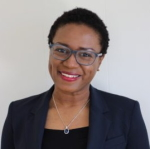
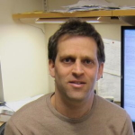
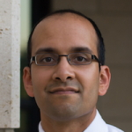
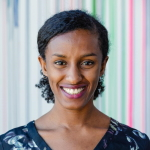

- - -

## Workshop Home

The second workshop on **Mechanism Design for Social Good** (MD4SG '18) will be held in conjunction with the [19th ACM Conference on Economics and Computation (EC '18)](http://sigecom.org/ec18/) at Cornell University in Ithaca, NY on June 22, 2018. It will feature invited speakers, contributed presentations, and domain-specific discussions among academic experts, field experts, and researchers from the EconCS community.

**Synopsis:** The EC community has made great contributions both to the development of theoretical foundations and applications of algorithms, optimization, and mechanism design. Key application domains have so far included ad auctions and electronic commerce, cloud computing, fair division, kidney donation, and school choice. In this workshop, we will focus on a set of promising directions that deal with improving _access to opportunity_ including bias and discrimination, online labor markets, and economic inequality. Each of these domains is concerned with how the government and citizens design allocation policies, impose tax structures, create laws, and regulate activities. These problems have the unifying property that progress has the potential to significantly improve societal welfare by improving individuals' access to opportunity.

The workshop will have three main components:

*   Keynote talks from domain experts in fields such as economics, information science, and public policy,
*   Domain-specific discussion between a diverse group of experts about where techniques from the EC community can be helpful, and
*   Presentations of submitted papers by members of the EC community.

The goal of this workshop is fourfold:

1.  Expose the EC community to new research directions through invited talks,
2.  Engage the workshop attendees with domain experts to foster future learning and collaboration opportunities,
3.  Jointly brainstorm and formalize research problems that the community can work on, and
4.  Highlight existing work in the community that falls under this theme.

More generally, we see this workshop as part of a broader goal to create and raise interest in different algorithmic and mechanism design problems with a social good objective.

**Sponsors:** The second Workshop on Mechanism Design for Social Good is generously supported by the [Schmidt Family Foundation](http://tsffoundation.org/), the [Institute for New Economic Thinking](https://www.ineteconomics.org/), and [EC](http://www.sigecom.org/ec18/).

**Organizers:** [Rediet Abebe](http://www.cs.cornell.edu/~red/) and [Kira Goldner](http://homes.cs.washington.edu/~kgoldner/)  
**Contact:** [organizers@md4sg.com](mailto:organizers@md4sg.com)

- - -

## Call for Papers

The 2nd Workshop on Mechanism Design for Social Good will be taking place at this year's ACM Conference on Economics and Computation at Cornell University on June 22, 2018.  
  
The goal of the workshop is to highlight work where insights from algorithms, optimization, and mechanism design have the potential to impact social good. In particular, we will focus on the theme of _improving access to opportunity_. The workshop will feature keynote presentations focusing on economic inequality, online labor markets, bias and discrimination. We encourage submissions addressing these and other domains, such as housing, healthcare, education, civic participation, privacy, and the developing world. The workshop aims to showcase ongoing exemplary work on these topics and to highlight exciting opportunities for future research. Submissions of all types are encouraged, including **theoretical** or **applied** mechanism design work, research that solves algorithmic or optimization problems, and **empirical** research that suggests future directions at this interface and **position** papers.  
  
Topics of interest for this workshop include but **are not limited to**:
*   redistributive mechanisms to improve access to opportunity
*   economic inequality and intergenerational mobility
*   mitigating unequal economic outcomes in online labor markets
*   detecting existence or causes of exploitative market behavior in online labor markets
*   the design of algorithms that mitigate bias and improve diversity
*   allocating low-income housing assistance
*   allocating health insurance funds, managing access to healthcare, and pricing medical treatments
*   design of health insurance markets
*   evaluating students, teachers, or schools
*   design of transportation systems
*   market regulations for data and privacy
*   algorithmic solutions to encourage civic participation
*   evaluating fairness in electoral representation

Submissions will be evaluated on the following criteria:
*   Quality of submission as measured by accuracy and clarity of exposition.
*   Relevance to this workshop and its theme of improving access to opportunity.
*   Novelty of domain: we particularly encourage work on applications that have been less explored within the EC community.
*   Potential for follow-up work in the EC community: those from other communities who feel they fit this criterion are especially encouraged to submit.

**Submission Instructions:**  
Authors should upload a PDF of their paper to [EasyChair](https://easychair.org/conferences/?conf=md4sg18). There are no specific formatting instructions. Submissions may either be working papers or papers that have been published at an established conference or journal. In the latter case, please include a citation on EasyChair. In addition to the PDF, authors are asked to upload a 200-250 word description onto EasyChair summarizing the results and their relevance to the workshop. There are no length requirements. The committee reserves the right not to review all the technical details of submissions.  
  
Authors may submit papers that are already under review or accepted in conferences or journals. However, papers accepted to this year's EC will not be considered for presentation at the workshop. There will be no published proceedings.  
  
**Important Information:**

*   Submission Deadline: April 21, 2018, 11:59pm AoE
*   Submission page: [EasyChair](https://easychair.org/conferences/?conf=md4sg18)
*   Notification: May 13, 2018
*   Workshop Date: June 22, 2018

**Organizing Committee:**  
Program Chairs:
*   [Rediet Abebe](http://www.cs.cornell.edu/~red/), Cornell University
*   [Kira Goldner](http://homes.cs.washington.edu/~kgoldner/), University of Washington

Program Committee:
*   [Hamsa Sridhar Bastani](https://hamsabastani.github.io/), IBM Research and University of Pennsylvania
*   [Mark Braverman](http://www.cs.princeton.edu/~mbraverm/pmwiki/index.php?n=Site.Main?setview=display), Princeton University
*   [Shuchi Chawla](http://pages.cs.wisc.edu/~shuchi/), University of Wisconsin-Madison
*   [Sanmay Das](http://www.cse.wustl.edu/~sanmay/), Washington University in St. Louis
*   [Nikhil Devanur](http://www.nikhildevanur.com/), Microsoft Research Redmond
*   [John P. Dickerson](http://jpdickerson.com/), University of Maryland
*   [Vasilis Gkatzelis](https://www.cs.drexel.edu/~gkatz/), Drexel University
*   [Lily Hu](https://scholar.harvard.edu/lilyhu), Harvard University
*   [Anna Karlin](http://homes.cs.washington.edu/~karlin/), University of Washington
*   [Jon Kleinberg](https://www.cs.cornell.edu/home/kleinber/), Cornell University
*   [Karen Levy](http://www.karen-levy.net/), Cornell University
*   [Irene Lo](http://www.columbia.edu/~iyl2104/), Columbia University
*   [Nicholas Mattei](http://www.nickmattei.net/), IBM TJ Watson
*   [Brian McInnis](http://infosci.cornell.edu/forward-thinking-people/phds/brian-mcinnis), Cornell University
*   [Suresh Naidu](http://tuvalu.santafe.edu/~snaidu/), Columbia University
*   [Manish Raghavan](http://www.cs.cornell.edu/~manish/), Cornell University
*   [Eric Sodomka](https://research.fb.com/people/sodomka-eric/), Facebook
*   [Sam Taggart](http://www.samueltaggart.com/), Oberlin College
*   [Daniel Waldinger](http://economics.mit.edu/grad/dwalding), MIT
*   [Matt Weinberg](http://www.cs.princeton.edu/~smattw/), Princeton University

- - -

## Program

The full program of the workshop will take place on June 22 in Room #196 at the Statler Hotel on Cornell's campus at 130 Statler Dr, Ithaca, NY 14853. A [PDF](../../assets/events/md4sg2018/programpdf.pdf) of the program is available for download.

| **Time**        | **Event**                                                                                                          | **Authors**                                                                                                                                        |
|-------------|----------------------------------------------------------------------------------------------------------------|------------------------------------------------------------------------------------------------------------------------------------------------|
| 9:00-9:05   | Opening Remarks                                                                                                | Rediet Abebe and Kira Goldner                                                                                                                  |
| 9:05-10:30  | Session 1: Economic Inequality                                                                                 |
| 9:05-9:35   | Keynote: Economic Inequality                                                                                   | Kendra Bischoff                                                                                                                                |
| 9:35-9:47   | Fairness in college admission exams: From test score gaps to earnings inequality*                              | Evan Riehl                                                                                                                                     |
| 9:48-10:00  | Access to opportunity in an era of extreme inequality* [link](http://science.sciencemag.org/content/early/2017/04/21/science.aal4617.full)                                                  | Robert Manduca                                                                                                                                 |
| 10:00-10:30 | Research Discussion: Economic Inequality                                                                       | Kendra Bischoff, Nicole Immorlica, Robert Manduca, and Evan Riehl                                                                              |
| 10:30-11:00 | Break                                                                                                          |
| 11:00-12:30 | Session 2: Bias and Discrimination                                                                             |
| 11:00-11:30 | Keynote: Bias and Discrimination                                                                               | Ifeoma Ajunwa                                                                                                                                  |
| 11:30-11:42 | Preventing Fairness Gerrymandering: Auditing and Learning for Subgroup Fairness* [link](https://arxiv.org/abs/1711.05144)                        | Seth Neel, Zhiwei Steven Wu, Aaron Roth, and Michael Kearns                                                                                    |
| 11:43-11:55 | Algorithmic Glass Ceiling in Social Networks* [link](https://dl.acm.org/citation.cfm?id=3186140)                                                           | Ana-Andreea Stoica, Christopher Riederer, and Augustin Chaintreau                                                                              |
| 11:55-12:30 | Research Discussion: Bias and Discrimination                                                                   | Ifeoma Ajunwa, Solon Barocas, Jamie Morgenstern, and Brittny Saunders                                                                          |
| 12:30-2:00  | Lunch and Poster Session in Carrier Ballroom, Statler Hotel                                                    |
| 2:00-3:30   | Session 3: Online Labor Markets and Matching Mechanisms                                                        |
| 2:00-2:30   | Keynote: Online Labor Markets                                                                                  | Ramesh Johari                                                                                                                                  |
| 2:30-2:42   | Kudu: Designing and Evolving an Electronic Agricultural Marketplace in Uganda*                                 | Neil Newman, Lauren Falcao-Bergquist, Nicole Immorlica, Kevin Leyton-Brown, Brendan Lucier, Craig McIntosh, John Quinn, and Richard Ssekibuule |
| 2:43-2:55   | Matching for the Israeli "Mechinot" Gap Year: Handling Rich Diversity Requirements                             | Yannai A. Gonczarowski, Lior Kovalio, Noam Nisan, and Assaf Romm                                                                               |
| 2:55-3:30   | Research Discussion: Online Labor Markets                                                                      | Itai Ashlagi, Yujie (Julie) Chen, Ramesh Johari, and David Robinson                                                                            |
| 3:30-4:00   | Break                                                                                                          |
| 4:00-4:40   | Session 4: Housing                                                                                             |
| 4:00-4:12   | Targeting In-Kind Transfers Through Market Design: A Revealed Preference Analysis of Public Housing Allocation | Daniel Waldinger                                                                                                                               |
| 4:13-4:25   | Allocating Interventions Based on Counterfactual Predictions: A Case Study on Homelessness Services* [link](https://www.cse.wustl.edu/~sanmay/papers/allocating-interventions-homelessness.pdf)    | Amanda Kube, Sanmay Das, and Patrick Fowler                                                                                                    |
| 4:27-4:39   | The Public-Housing Allocation Problem [link](http://scholar.harvard.edu/files/nthakral/files/Thakral_match.pdf)                                                                   | Neil Thakral                                                                                                                                   |
| 4:40-5:30   | Session 5: New Directions in Mechanism Design                                                                  |
| 4:40-4:52   | Bike Angels: An Analysis of Citi Bike's Incentive Program                                                      | Hangil Chung, Daniel Freund, and David Shmoys                                                                                                  |
| 4:53-5:05   | A Dynamic Discrete Choice Model of Disciplinary Policy and Deviant Behavior in Schools*                        | David McMillon                                                                                                                                 |
| 5:05-5:17   | Pay-for-Selection? Systematic Healthcare Market Inefficiency in Capitation Payment Programs*                   | Zhaowei She and Turgay Ayer                                                                                                                    |
| 5:18-5:30   | Exploiting Uncertainty to Create Buyer-Optimal Outcomes in Renewable Energy Markets*                           | Pan Li, Shreyas Sekar, and Baosen Zhang                                                                                                        |

*will also present a poster

Posters:
*   "Adapting a Kidney Exchange Algorithm to Align with Human Values" \[[link](https://users.cs.duke.edu/~conitzer/kidneyAAAI18.pdf)\] by Rachel Freedman, Jana Schaich Borg, Walter Sinnott-Armstrong, John P. Dickerson, and Vincent Conitzer
*   "A Hybrid Technique for Partner Selection in Virtual Enterprises" by George Musumba
*   "A Proposal for a Pollution Fee and Dividend Policy in New Jersey" \[[link](https://docs.google.com/document/d/1QO9b_jgCUgJXu9StKHxTEV_rr_SfyaiO7emdlnR2Fjk/edit)\] by Jonathan Shi
*   "Decision Support for Policymaking: Causal Inference Algorithm and Case Study" by Bhanukiran Vinzamuri, Aleksandra Mojsilovic, and Kush R Varshney
*   "Disaster Lending: The Distributional Consequences of Government Lending Programs" \[[link](https://papers.ssrn.com/sol3/papers.cfm?abstract_id=3145298)\]by Umit Gurun, Taylor Begley, Amiyatosh Purnanandam, and Daniel Weagley
*   "How to foster innovation: A data-driven approach to measuring economic competitiveness" by Caitlin Kuhlman, Karthikeyan Natesan Ramamurthy, Prasanna Sattigeri, Aurelie Lozano, Lei Cao, Chandra Reddy, Aleksandra Mojsilovic, and Kush Varshney
*   "On the Dynamics of Inequality in Selfish Crowds" by Arthi Ramachandran, Natania Wolansky, and Augustin Chaintreau
*   "Optimal taxation and endogenous growth" \[[link](http://sites.google.com/site/ravijagadeesan/tax-growth.pdf)\] by Ravi Jagadeesan
*   "The Reassignment Problem" \[[link](http://www.cs.tufts.edu/~cowen/reassignment.pdf)\] by Lenore Cowen, Tara Kola, and Eli Rosmarin
*   "Towards Minimization of Food insecurity in Developing Nations: Block-Chain and Artificial Intelligence Opportunities in small-scale farming" by Benjamin Otieno and George Musumba

- - -

## Invited Speakers

We will three keynote talks from domain experts on economic inequality, bias and discrimination, and online labor markets. Keynote speakers include:
*   Bias and Discrimination Keynote: [Ifeoma Ajunwa](http://ifeomaajunwa.com/), Cornell University, Industrial and Labor Relations School
*   Economic Inequality Keynote: [Kendra Bischoff](https://sociology.cornell.edu/kendra-bischoff), Cornell University, Department of Sociology
*   Online Labor Markets Keynote: [Ramesh Johari](http://web.stanford.edu/~rjohari/), Stanford University, Management Science and Engineering

We will also research discussions on future directions in the same three areas, featuring domain experts, field experts, and moderated by members of the EC community.

Bias and Discrimination Invited Research Discussants:
*   (Moderator) [Jamie Morgenstern](http://jamiemorgenstern.com/), Georgia Institute of Technology, Computer Science
*   [Ifeoma Ajunwa](http://ifeomaajunwa.com/), Cornell University, Industrial and Labor Relations School
*   [Solon Barocas](http://solon.barocas.org/), Cornell University, Department of Information Science
*   [Brittny Saunders](https://www1.nyc.gov/site/cchr/about/our-team.page), NYC Commission on Human Rights

Economic Inequality Invited Research Discussants:
*   (Moderator) [Nicole Immorlica](http://www.immorlica.com/), Microsoft Research
*   [Kendra Bischoff](https://sociology.cornell.edu/kendra-bischoff), Cornell University, Department of Sociology
*   [Robert Manduca](http://www.robertmanduca.com/), Harvard University, Sociology and Social Policy
*   [Evan Riehl](http://riehl.economics.cornell.edu/), Cornell University, Economics

Online Labor Markets Invited Research Discussants:
*   (Moderator) [Itai Ashlagi](https://web.stanford.edu/~iashlagi/), Stanford University, Management Science and Engineering
*   [Yujie Julie Chen](https://www2.le.ac.uk/departments/media/people/dr-yujie-chen), University of Leicester, Media, Communication, and Sociology
*   [Ramesh Johari](http://web.stanford.edu/~rjohari/), Stanford University, Management Science and Engineering
*   [David Robinson](https://www.upturn.org/about/david-robinson/), Managing Director, Upturn

## Invited Speakers and Research Discussants

### Ifeoma Ajunwa, Cornell University, Industrial and Labor Relations School

[Ifeoma Ajunwa](http://ifeomaajunwa.com/) is an Assistant Professor in the Organizational Behavior Department of Cornell's Industrial and Labor Relations School. She earned her PhD in Sociology from Columbia University. Her doctoral work received support from the National Science Foundation (NSF) and honorable mention by the Ford Foundation. Immediately prior to her position at Cornell ILR School, she was a Fellow at the Berkman Klein Center at Harvard University (where she remains a Faculty Associate) and she served as a Teaching Fellow at Harvard Law School. Professor Ajunwa researches the organizational behavior of organizations, particularly in relation to stigma/social evaluation, diversity, and the adoption of new work technologies. Other related research interests include labor and employment law, as well as, business and society concerns.

### Itai Ashlagi, Stanford University, Management Science and Engineering

[Itai Ashlagi](https://web.stanford.edu/~iashlagi/) is an Assistant Professor at the Management Science & Engineering Department. He is interested in game theory and the design of marketplaces and especially matching markets. His work influenced the practice of Kidney exchange, for which he has become a Franz Edelman Laureate. Ashlagi received his PhD in operations research from the Technion-Israel Institute of Technology. Before coming to Stanford he was an assistant professor of Operations Management at Sloan, MIT and prior to that a postdoctoral researcher at HBS. He received the outstanding paper award in the ACM conference of Electronic Commerce 2009 and the NSF-CAREER award.

### Solon Barocas, Cornell University, Department of Information Science

[Solon Barocas](http://solon.barocas.org/) is an Assistant Professor in the Department of Information Science at Cornell University. His current research explores ethical and policy issues in artificial intelligence, particularly fairness in machine learning, methods for bringing accountability to automated decision-making, and the privacy implications of inference. In 2014, he co-founded Fairness, Accountability, and Transparency in Machine Learning (FAT/ML), an annual workshop that brings together an emerging community of researchers working on these issues. He went on to help launch Fairness, Accountability, and Transparency as a stand-alone conference in 2018. Solon was previously a Postdoctoral Researcher at Microsoft Research, where he worked with the Fairness, Accountability, Transparency, and Ethics in AI group, as well as a Postdoctoral Research Associate at the Center for Information Technology Policy at Princeton University. He completed his doctorate in the Department of Media, Culture, and Communication at New York University, where he remains a Visiting Scholar at the Center for Urban Science + Progress.

### Kendra Bischoff, Cornell University, Department of Sociology

[Kendra Bischoff](https://sociology.cornell.edu/kendra-bischoff) is an assistant professor of sociology at Cornell University. She received her PhD in sociology from Stanford University and was subsequently a post-doctoral fellow in equality of opportunity and education at Stanford University's Center for Ethics in Society. Her research focuses on social stratification and inequality, schooling, social demography, and urban sociology. In current and past projects, she investigates the causes and consequences of racial and economic residential segregation, the changing demographic relationship between schools and their local neighborhoods, and the civic mission of K-12 schools. She is currently a National Academy of Education / Spencer Foundation Fellow.

### Yujie Julie Chen, University of Leicester, Media, Communication, and Sociology

[Yujie Julie Chen](https://www2.le.ac.uk/departments/media/people/dr-yujie-chen) is a Lecturer in Digital Media and Communication in the School of Media, Communication and Sociology at the University of Leicester. She studies and writes about digital labor issues, particularly focusing on 1) how interplay among technologies, cultural contexts, and existing socio-economic structures impacts on the experience and perceptions of digital work and 2) how workers' lived experience technologies help them construct their own narratives. She has published works on drivers on ride-hailing platforms in China. She is working on two projects at the moment. The first one is a book manuscript on why labor is missing from the framework of datafication, and the second one is to explore the platform workers's work world in China, primarily gig drivers and food-deliver app workers.

### Nicole Immorlica, Microsoft Research

[Nicole Immorlica](http://www.immorlica.com/)'s research lies broadly within the field of algorithmic game theory. Using tools and modeling concepts from both theoretical computer science and economics, Nicole hopes to explain, predict, and shape behavioral patterns in various online and offline systems, markets, and games. Her areas of specialty include social networks and mechanism design. Nicole received her Ph.D. from MIT in Cambridge, MA in 2005 and then completed three years of postdocs at both Microsoft Research in Redmond, WA and CWI in Amsterdam, Netherlands before accepting a job as an assistant professor at Northwestern University in Chicago, IL in 2008. She joined the Microsoft Research New England Lab in 2012.

### Ramesh Johari, Stanford University, Management Science and Engineering

[Ramesh Johari](http://web.stanford.edu/~rjohari/) is an Associate Professor at Stanford University, with a full-time appointment in the Department of Management Science and Engineering (MS&E), and courtesy appointments in the Departments of Computer Science (CS) and Electrical Engineering (EE). He is a member of the Operations Research group and the Social Algorithms Lab (SOAL) in MS&E, the Information Systems Laboratory in EE, and the Institute for Computational and Mathematical Engineering. He received an A.B. in Mathematics from Harvard, a Certificate of Advanced Study in Mathematics from Cambridge, and a Ph.D. in Electrical Engineering and Computer Science from MIT. His research interests include design, analysis, and optimization of online platforms.

### Robert Manduca, Harvard University, Sociology and Social Policy

[Robert Manduca](http://www.robertmanduca.com/) is a PhD student in sociology and social policy at Harvard University. His research focuses on urban economic development and on the effects of economic inequality on US society. Current projects include documenting trends in absolute income mobility in the US and abroad and exploring the causes of economic polarization between US metro areas. Prior to beginning his PhD he completed a Master's in City Planning at MIT and was a fellow at Data Science for Social Good.

### Jamie Morgenstern, Georgia Institute of Technology

[Jamie Morgenstern](http://jamiemorgenstern.com/) is an assistant professor in the School of Computer Science Georgia Tech. Prior to this appointment, she was fortunate to be hosted by Michael Kearns, Aaron Roth, and Rakesh Vohra for a Warren Center postdoc at the University of Pennsylvania, and completed her PhD working with Avrim Blum at Carnegie Mellon University. She studies the social impact of machine learning and the impact of social behavior on ML's guarantees. How should machine learning be made robust to behavior of the people generating training or test data for it? How should ensure that the models we design do not exacerbate inequalities already present in society?

### Evan Riehl, Cornell University, Economics

[Evan Riehl](http://riehl.economics.cornell.edu/) is an assistant professor in the Department of Economics and ILR School at Cornell University. He received a PhD in economics from Columbia University in 2017 and a BA in economics/political science from Washington University in St. Louis in 2008. His research interests are in labor and development economics with a focus on higher education. His recent work examines how signals of individual ability affect the match between students and colleges, and their implications for labor market outcomes. This includes projects on the design of college admission exams, the role of college reputation, and the interaction between college grading policies and peer quality.

### David Robinson, Managing Director, Upturn

[David Robinson](https://www.upturn.org/about/david-robinson/) is a Managing Director and cofounder of Upturn. David works to empower the public, advocates, and policymakers to influence the high tech systems that shape our daily lives, from courtroom algorithms to 'predictive policing' systems to gig economy platforms. He has a long-term interest in concrete ways that data-driven systems can support, or frustrate, civic goals of justice, equity and opportunity. Before Upturn, David served as the inaugural Associate Director of Princeton University's Center for Information Technology Policy, a joint venture between the university's School of Engineering and its Woodrow Wilson School of Public and International Affairs. David serves as an Adjunct Professor of Law at Georgetown University Law Center, where he teaches a seminar he created on Governing Automated Decisions. He holds a JD from Yale Law School, and bachelor's degrees in philosophy from Princeton and Oxford, where he was a Rhodes Scholar.

### Brittny Saunders, NYC Commission on Human Rights

[Brittny Saunders](https://www1.nyc.gov/site/cchr/about/our-team.page) is Deputy Commissioner for Strategic Initiatives at the NYC Commission on Human Rights ('Commission'). At the Commission, Brittny manages key inter-agency partnerships and special projects related to data-driven discrimination and racial justice among others. Before joining the Commission, Brittny worked for the Office of the Mayor, most recently as Acting Counsel to the Mayor. Prior to that, as Deputy Counsel, Brittny played a central role in the Office's broadband equity efforts, working to ensure affordable access to high-speed internet for residents of the five boroughs. Brittny also helped craft legislation barring discrimination on the bases of credit and criminal history in the employment context, codifying the Commission on Gender Equity ('CGE') and addressing other important challenges facing the city. Before joining local government, Brittny worked for the Center for Popular Democracy ('CPD'), where she was Supervising Attorney for Immigrant Rights and Racial Justice, driving policy development and advocacy on a range of topics including education and language access. Prior to that, Brittny was Senior Advocate at the Center for Social Inclusion ('CSI' now 'RaceForward'), where she worked on disaster and emergency, broadband, transportation and transparency and accountability policies from a racial justice perspective. Brittny was a 2010 Fellow in Media, Information & Communications Policy with the Rockwood Leadership Institute. She has an A.B. from Harvard College and a J.D. from Harvard Law School.

- - -

## Travel Support

We are very pleased to provide funds to subsidize the costs of registration, travel, and accommodation for student presenters, and for MD4SG workshop participants who do not typically attend the EC conference, including non-academic participants. Travel grants are limited and will be made available based on participant need and relevance to workshop.  
  
To apply, please email [organizers@md4sg.com](mailto:organizers@md4sg.com) with the subject line "Travel Support" by **April 24**, and address the following points:

*   First and last name
*   Department and University / Organization
*   Advisor's name (if applicable)
*   Are you from an organization or department that is not typically represented at EC?
*   What is the expected estimate of support needed for travel, registration, and accommodation?
*   Identification of any underrepresented groups, if applicable. (We encourage applications from members of underrepresented groups.)
*   Do you have access to other funds which would allow you to attend the workshop?
*   Describe in a sentence or two how you will benefit from attending the workshop.

You will be notified about your status by May 13, which is prior to the EC early registration deadline.  
  
Funds were generously made available by the [Schmidt Family Foundation](http://tsffoundation.org/), by the [Institute for New Economic Thinking](https://www.ineteconomics.org/), and by [EC](http://www.sigecom.org/ec18/).

- - -
## About

**Organizers:** [Rediet Abebe](http://www.cs.cornell.edu/~red/) and [Kira Goldner](http://homes.cs.washington.edu/~kgoldner/)  
**Contact:** [organizers@md4sg.com](mailto:organizers@md4sg.com)

The organizers of this workshop also co-organize an interdisciplinary, multi-institution research group that explores potential domains for mechanism design for social good.

## Organizers

### Rediet Abebe, Cornell University

[Rediet Abebe](http://www.cs.cornell.edu/~red/) is a third-year PhD student at Cornell University in the Department of Computer Science, advised by Jon Kleinberg. Her research focuses on algorithms, artificial intelligence, and applications to social good. She is specifically interested in using techniques and insights from these areas to better understand and implement interventions for problems related to socioeconomic inequality. Her work has generously been supported by fellowships and scholarships through Facebook (2017-2019), Google (2016-2017), and the Cornell Graduate School (2015-2016). Prior to Cornell, she completed an M.S. in Applied Mathematics from Harvard University, an M.A. in Mathematics from the University of Cambridge, and a B.A. in Mathematics from Harvard University. She was born and raised in Addis Ababa, Ethiopia.

### Kira Goldner, University of Washington

[Kira Goldner](http://homes.cs.washington.edu/~kgoldner/) is a fourth-year PhD student at the University of Washington in the Department of Computer Science and Engineering, advised by Anna Karlin. Her research focuses on problems in mechanism design, particularly on (1) maximizing revenue in settings that are motivated by practice and (2) on mechanism design within health insurance and online labor markets. She is a 2017-19 recipient of the Microsoft Research PhD Fellowship and was a 2016 recipient of a Google Anita Borg Scholarship. Kira received her B.A. in Mathematics from Oberlin College and also studied at Budapest Semesters in Mathematics.