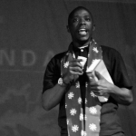
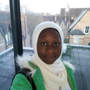

- - -
The MD4SG initiative held a presentation and discussion focused on the MD4SG and ICTD interface at the 2nd ACM COMPASS Conference, held in Accra, Ghana in July, 2019. The recording of this event can be found at [this link](https://www.youtube.com/watch?v=46gIqhB24KU).

## Organizers

### Mutembesa Daniel, Makerere University

Mutembesa Daniel is a researcher & collaborations lead at the Makerere Artificial Intelligence Research labs. He focuses on algorithmic game theory and mechanism design, behavioural and forecast modelling in crowdsourcing games and applied artificial intelligence in the developing world. His research covers algorithmic mechanism design of community sensing games for surveillance in agriculture and health, modelling participant behaviour in their unique low-resource settings, exploring community graph networks, and machine learning models to forecasting risk burden of rural communities for diseases like malaria.

### Memunat Ibrahim, Multiskills Nigeria Limited

Memunat Ibrahim works as a Software Developer at Multiskills Nigeria Limited. She has a B.Sc. Degree in Computer Science. She is a curious researcher interested in solving local problems using AI, mechanism design, and software development expertise. She believes there are lots of interesting problems to be solved with software development and artificial intelligence, especially in developing nations. Bridging the gap between these problem domains and AI expertise will yield a massive inclusive economic and social growth.

### Ifeoma Okoh, University of Ibadan, Nigeria

Ifeoma Okoh is a masters student at the University of Ibadan, Nigeria, majoring in mathematics. Her areas of interest are on operations research and finding better ways to solve mechanism design problems. She loves traveling and meeting people.

## Advisors
*   [Rediet Abebe](http://www.cs.cornell.edu/~red/), Harvard University
*   [Irene Lo](https://sites.google.com/view/irene-lo), Stanford University