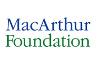
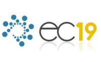
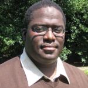
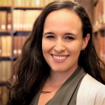
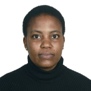

- - -

## Workshop Home

**Congratulations to the MD4SG'19 award winners.**

Best paper: **Zoe Hitzig**, _"Bridging the 'Normative Gap': Mechanism Design and Social Justice"_  
Best paper with a student presenter: **Anay Mehrotra**, _Toward Controlling Discrimination in Online Ad Auctions_  
Popular poster awards: **Daniel Mutembesa**, _"Incentive Mechanism for Mobile Community Sensing with Smallholder Farmers in a Developing Nation"_, and **Min Kyung Lee**, _"WeBuildAI: Participatory Framework for Algorithmic Governance"_

### The Youtube livestreams for the [morning](https://www.youtube.com/watch?v=Bc1CECIxio0) and [afternoon](https://www.youtube.com/watch?v=rF5hq9o_TfE) sessions are available online.

The third workshop on **Mechanism Design for Social Good** (MD4SG '19) will be held in conjunction with the [20th ACM Conference on Economics and Computation (EC '19)](http://sigecom.org/ec19/) in Phoenix, Arizona, USA on June 28, 2019. The goal of the workshop is to highlight work where techniques from algorithms, optimization, and mechanism design, along with insights from other disciplines, have the potential to improve access to opportunity for historically underserved and marginalized communities. The workshop will feature keynote presentations, contributed talks, problem pitches and demos, a poster session, and a panel discussion, with a focus on _bridging research and practice_. To this end, participants will include researchers as well as practitioners in various government and non-government organizations and industry.

The workshop will have four main components:
*   Keynote talks from leading academics and domain experts in _Development_, _AI Ethics_, and _Energy and Climate Change_,
*   Presentations of submitted papers by members of the EC community, and
*   Problem pitches and product demonstrations from domain experts and practitioners,
*   A panel discussion on bridging research and practice, with a focus on the limitations of theoretical modeling in providing implementable solutions.

The goal of this workshop is fourfold:

1.  Expose the EC community to new and emerging research directions through invited talks,
2.  Foster collaborations with domain experts, including those outside of the academy, through problem pitches and a networking event,
3.  Jointly brainstorm and formalize research problems that the community can work on, and
4.  Highlight exemplary work from the EC community and adjacent communities that falls under this theme.

More generally, we see this workshop as part of a broader goal to create and raise interest in different algorithmic and mechanism design problems with a social good objective.

## Sponsors

The Third Workshop on Mechanism Design for Social Good is generously supported by _Schmidt Futures_, the _MacArthur Foundation_, the _ACM Conference on Economics and Computation_, and the _Institute for New Economic Thinking -- Young Scholars Initiative_.

**Organizers:** [Rediet Abebe](http://www.cs.cornell.edu/~red/) and [Irene Lo](https://sites.google.com/view/irene-lo)  
**Contact:** [organizers@md4sg.com](mailto:organizers@md4sg.com)

- - -

Call for Participation
==

* * *

The 3rd Workshop on Mechanism Design for Social Good (MD4SG '19) will take place at this year's ACM Conference on Economics and Computation (EC '19) in Phoenix, AZ, USA on **28 June 2019**.
  
The goal of the workshop is to highlight work where techniques from algorithms, optimization, and mechanism design, along with insights from other disciplines, have the potential to _improve access to opportunity_ for historically underserved and marginalized communities. The workshop will feature keynote presentations, contributed talks, problem pitches and demonstrations, a poster session, and a panel discussion, with a focus on _bridging research and practice_.  
  
We solicit submissions of research papers, as well as special problem- and practice-driven submissions, to be presented at the workshop. The deadline for submissions is **27 April 2019 at 5 PM GMT**. We also solicit applications for travel grants. The deadline for travel grant applications is **15 April 2019 at 5 PM GMT**.  
  
We encourage submissions from across various disciplines and covering domains including bias and discrimination, civic participation, computational sustainability, developing nations, economic inequality, education, healthcare, housing, on- and off-line labor markets, and privacy and security. Submissions can be research papers introducing new theory or applications, as well as position papers synthesizing existing work and perspectives or highlighting future directions. For the first time, the workshop will also accept problem pitches and demonstration submissions. Submissions will fall into one of four tracks:  

*   **AI and Machine Learning** including bias, fairness, and ethics, fair division and resource allocation, human computer interaction in socio-technical systems; multi-agent systems, privacy and security, social choice theory, and statistical reasoning.
*   **Empirical Studies** including applied machine learning, causal inference, computational social science, empirical analysis of real-world systems, empirical methods, and experimental results.
*   **Theory** including algorithm design, fair division and resource allocation, game theory, market and mechanism design, optimization, operations management, computational social choice, social network analysis, and theory of machine learning.

In addition, we will also accept special submissions as problem pitches or demonstrations. We especially encourage individuals from government and non-government organizations and industry to submit to this track.  

*   **Problems and Demonstrations**:
    *   **Problem Pitches** including white papers on problems arising in practice that deserve wider academic attention, and papers pitching methods for addressing real-world problems through research. Submissions should provide (1) background information on the problems, (2) examples of how techniques for resource allocation, definition of appropriate metrics and objectives, design of systems, alignment of incentives, and related issues could significantly alleviate these problems, and (3) summary of any existing methods or approaches for addressing these problems. Submissions are also encouraged to provide a discussion of challenges in providing holistic solutions and/or introduce new methods for addressing the problems.
    Submissions will be evaluated based on their contributions to one or more of the following:
    
    *   Novelty of problem/domain to the EC community
    *   Comprehensive exposition of background on problem and attempted solutions
    *   Potential for future collaborations and/or follow up from the EC community
    *   Discussion of practical, structural and/or societal challenges in attempted or proposed solutions
    
    *   **Demonstrations** including prototyped and/or deployed software systems and mobile platforms. Demo submissions should be accompanied by a short description describing the system or platform, the problems it seeks to address, and the potential to use the tool in conjunction with algorithm and mechanism design and related tools to improve access to opportunity. Submissions should also include instructions for using the system or platform.
  
For all submissions, topics of interest include but **are not limited to**:

*   market and mechanism design challenges in resource-constrained settings
*   measuring and evaluating progress to achieve sustainable development goals
*   reducing inefficiencies in smallholder farms and under-resourced supply chains
*   allocating health insurance funds and managing access to healthcare
*   equitable provision of healthcare across communities
*   algorithmic proposals to encourage civic participation
*   evaluating fairness in electoral representation
*   redistributive mechanisms to improve access to opportunity
*   economic inequality and intergenerational mobility
*   mitigating unequal economic outcomes in on- and off-line labor markets
*   detecting existence or causes of exploitative market behavior in on- and off-line labor markets
*   the design of algorithms that mitigate bias and improve diversity
*   allocating low-income housing assistance
*   evaluating students, teachers, or schools and improving allocation of educational resources
*   design of transportation systems
*   market regulations for data and privacy
*   ethics of using solutions informed by algorithm and mechanism design in public sector settings
  
Submissions will be evaluated on the following criteria:

*   _Quality of submission_ as measured by accuracy and clarity of exposition.
*   _Relevance_ to MD4SG and the workshop theme of _bridging research and practice_.
*   _Novelty of domain_: we particularly encourage work on applications that have been less explored within the EC community.
*   In line with the focus on bridging research and practice, submissions will also be evaluated based on either:

*   _Potential for interdisciplinary follow-up work_. We welcome submissions with the potential to spark interdisciplinary collaborations with the EC community,
*   _Presentation of domain-specific knowledge_. We especially welcome practitioners with interest or experience in translating between practical problems and academic research approaches.

Submission Instructions:
------------------------
  
Authors should upload a PDF of their paper to [EasyChair](https://easychair.org/conferences/?conf=md4sg19). There are no specific formatting instructions or length requirements. In addition to the PDF, authors are asked to upload a 200-250 word description onto EasyChair summarizing their submission and its relevance to the workshop. Authors do not need to be first author of the submitted work. Authors should list all co-authors on the presented work both in the PDF of the submission as well as on EasyChair.  
  
Authors may submit papers that are working papers, papers that have already been published, or are under review. If the work is already published, please include a citation on EasyChair.  
  
There will be no published proceedings. All submissions will be peer-reviewed by at least 2 reviewers. The committee reserves the right not to review all the technical details of submissions. Submissions are single-blind (i.e., authors should include their name and affiliation in the paper).  
  

Travel Grants:
--------------
  
The workshop will provide a number of need-based travel grants to participants to subsidize the costs of registration, travel, and accomodation at the workshop. Awardees of the travel grants will have the opportunity to participate in an interdisciplinary networking session with members of the broader MD4SG and EC community. Preference will be given to individuals who have submitted papers to the workshop or the EC conference before the travel grant submission deadline. We especially encourage those from underrepresented communities and institutions to submit a travel grant application.  
  
**All travel grant applications must be submitted by 15 April 2019 at 5 PM GMT**; applications received after this date will not be considered.  

Important Information:
----------------------

*   Travel Grant Application Deadline: 15 April 2019 at 5 PM GMT
*   Travel Grant: [Application Form](https://docs.google.com/forms/d/e/1FAIpQLSf8QWwD3eoto9gPat_3aHe2lWIbqCC6WX3GmcXZAoL1PlqTiw/viewform)
*   Paper Submission Deadline: 27 April 2019 at 5 PM GMT
*   Paper Submission Page: [EasyChair](https://easychair.org/conferences/?conf=md4sg19)
*   Notification: 15 May 2019
*   Workshop Date: 28 June 2019

Organizing Committee:
---------------------

### Program Chairs:

*   [Rediet Abebe](http://www.cs.cornell.edu/~red/), Cornell University
*   [Irene Lo](https://sites.google.com/view/irene-lo), Stanford University

### Area Chairs:

*   **Theory:** [Hamsa Bastani](https://hamsabastani.github.io/), University of Pennsylvania; [Kira Goldner](https://homes.cs.washington.edu/~kgoldner/), University of Washington
*   **Empirical Studies:** [Daniel Waldinger](https://sites.google.com/view/danielwaldinger), New York University
*   **AI and ML:** [Sanmay Das](https://www.cse.wustl.edu/~sanmay/), Washington University in St. Louis; [George Musumba](https://cs.dkut.ac.ke/emd_person/273/), Dedan Kimathi University of Technology
*   **Problems and Demos:** [Sera Linardi](http://www.linardi.gspia.pitt.html), University of Pittsburgh; [Aditya Vashistha](https://www.adityavashistha.com/), University of Washington
    
    ### Program Committee:
    
*   [Nick Arnosti](https://www8.gsb.columbia.edu/cbs-directory/detail/naa2165), Columbia University
*   [Itai Ashlagi](https://web.stanford.edu/~iashlagi/), Stanford University
*   [Solon Barocas](http://solon.barocas.org/), Cornell University
*   [Michael Best](https://www.cc.gatech.edu/people/michael-best), Georgia Institute of Technology
*   [Mark Braverman](http://www.cs.princeton.edu/~mbraverm/pmwiki/index.php?n=Site.Main?setview=display), Princeton University
*   [Augustin Chaintreau](http://www.cs.columbia.edu/~augustin/), Columbia University
*   [Lenore Cowen](http://www.cs.tufts.edu/~cowen/), Tufts University
*   [Rachel Cummings](https://pwp.gatech.edu/rachel-cummings/), Georgia Institute of Technology
*   [Nikhil Devanur](http://www.nikhildevanur.com/), Microsoft Research Redmond
*   [John P. Dickerson](http://jpdickerson.com/), University of Maryland
*   [Wedad Elmaghraby](https://www.rhsmith.umd.edu/directory/wedad-j-elmaghraby), University of Maryland
*   [Jason Hartline](https://sites.northwestern.edu/hartline/), Northwestern University
*   [Lily Hu](https://scholar.harvard.edu/lilyhu), Harvard University
*   [Nicole Immorlica](http://www.immorlica.com/), Microsoft Research New England
*   [Ramesh Johari](http://web.stanford.edu/~rjohari/), Stanford University
*   [Anna Karlin](http://homes.cs.washington.edu/~karlin/), University of Washington
*   [Jon Kleinberg](https://www.cs.cornell.edu/home/kleinber/), Cornell University
*   [Karen Levy](http://www.karen-levy.net/), Cornell University
*   [Dina Machuve](https://twiga2.github.io/dmachuve/), Nelson Mandela African Institution of Science and Technology
*   [Robert Manduca](http://robertmanduca.com/), Harvard University
*   [Francisco Marmolejo](https://www.cs.ox.ac.uk/people/francisco.marmolejocossio/), University of Oxford
*   [Nicholas Mattei](http://www.nickmattei.net/), IBM TJ Watson
*   [Nyalleng Moorosi](http://www.deeplearningindaba.com/nyalleng-moorosi.html), Google AI South Africa
*   [Suresh Naidu](http://tuvalu.santafe.edu/~snaidu/), Columbia University
*   [Moses Namara](http://mosesn.people.clemson.edu/), Clemson University
*   [Benjamin Otieno](#), Kibabii University
*   [Manish Raghavan](http://www.cs.cornell.edu/~manish/), Cornell University
*   [Sekou Remy](https://researcher.watson.ibm.com/researcher/view.php?person=ke-Sekou.Lionel.Remy), IBM Research Africa
*   [David Robinson](https://david.robinsonian.com/), Upturn
*   [Zhaowei She](https://www.isye.gatech.edu/users/zhaowei-she), Georgia Institute of Technology
*   [Peng Shi](http://www-bcf.usc.edu/~pengshi/), University of Southern California
*   [Eric Sodomka](https://research.fb.com/people/sodomka-eric/), Facebook Research
*   [Nicolas Stier](https://research.fb.com/people/stier-nicolas/), Facebook Research
*   [Sam Taggart](http://www.samueltaggart.com/), Oberlin College
*   [Eva Tardos](http://www.cs.cornell.edu/~eva/), Cornell University
*   [Kentaro Toyama](http://www.kentarotoyama.org/), University of Michigan
*   [Phebe Vayanos](http://www-bcf.usc.edu/~vayanou/), University of Southern California
*   [Matt Weinberg](http://www.cs.princeton.edu/~smattw/), Princeton University
*   [Bryan Wilder](http://teamcore.usc.edu/people/bryanwilder/default.htm), University of Southern California

- - -
## Program

The full program of the workshop will take place on June 28 in **Room 232A** at the Phoenix Convention Center in Phoenix, Arizona. A [PDF](../../assets/events/md4sg2019/program.pdf) of the program is available for download. We welcome all participants to attend the lunchtime poster session and [vote for your favorite poster](http://bit.ly/md4sg19poster).

| **Time**        | **Event**                                                                                                                      | **Authors**                                                                                                                                                                                                                                |
|-------------|----------------------------------------------------------------------------------------------------------------------------|----------------------------------------------------------------------------------------------------------------------------------------------------------------------------------------------------------------------------------------|
| 7:30-8:30   | Networking Breakfast (West building, Room 101A)                                                                            | Sara Kingsley and Eric Sodomka                                                                                                                                                                                                         |
| 8:30-8:35   | Opening Remarks                                                                                                            | Rediet Abebe and Irene Lo                                                                                                                                                                                                              |
| 8:35-09:45  | Session 1: Developing World                                                                                                |
| 8:35-9:20   | Keynote: Research Experiences Developing Technology in/for/from Africa                                                     | Sekou Remy                                                                                                                                                                                                                             |
| 9:20-9:35   | Design of Incentive Programs for Optimal Medication Adherence                                                              | Sze-Chuan Suen, Diana Negoescu and Joel Goh                                                                                                                                                                                            |
| 9:35-9:40   | Bridging Markets for Small Scale Farmers with Mechanism Design                                                             | Mwiza Simbeye, Mwila Kangwa and Patrick Sikalinda                                                                                                                                                                                      |
| 9:40-9:45   | Mechanism Design for Matching in Nigeria's National Youth Service Corps: A Case Study                                      | Ifeoma Okoh, Oluwakemi Akinwehinmi, Israel Akowe, Oluwakemi Fasae, Memunat Ibrahim, John Ojetunde, Peter Ogunremi, Rachel Ojo, Ifeoluwa Oladeji, Olajide Oladejo, Oluwafemi Olaoye, Tosin Oyetayo, Emmanuel Ozi-Yusuf and Eric Sodomka |
| 9:45-10:00  | Break                                                                                                                      |
| 10:00-11:20 | Session 2: Assignments and Choice                                                                                          |
| 10:00-10:45 | Keynote: Putting Ethical AI to the Vote                                                                                    | Ariel Procaccia                                                                                                                                                                                                                        |
| 10:45-11:00 | The Determinants of Physicians' Location Choice: Understanding the Rural Shortage                                          | Elena Falcettoni                                                                                                                                                                                                                       |
| 11:00-11:15 | The Short and Long Run Impacts of Centralized Clearinghouses: Evidence from Matching Teach For America Teachers to Schools | Jonathan Davis                                                                                                                                                                                                                         |
| 11:15-11:20 | Selling Fairness: Reflections on Commercializing the Course Match Allocation Mechanism                                     | Matt Boulos                                                                                                                                                                                                                            |
| 11:20-12:30 | FCRC Keynote (Symphony Hall, immediately south of Convention Center)                                                       | Eric Lindahl                                                                                                                                                                                                                           |
| 12:30-1:30  | Lunch and Poster Session: Vote for your favorite poster. (Room 301/Foyer)                                                  |
| 1:30-3:00   | Session 3: Law and Policy                                                                                                  |
| 1:30-2:15   | Keynote: Mechanisms to Reduce Greenhouse Gas Emissions	                                                                    | Valerie Thomas                                                                                                                                                                                                                         |
| 2:15-2:30   | Transparency and Fairness in School Choice Mechanisms                                                                      | Yoan Hermstruewer                                                                                                                                                                                                                      |
| 2:30-2:45   | Characterizing Models through Practices: A Case Study in Algorithmic Employment Screening                                  | Solon Barocas, Jon Kleinberg, Karen Levy and Manish Raghavan                                                                                                                                                                           |
| 2:45-3:00   | When to Limit Market Entry under Mandatory Purchase                                                                        | Meryem Essaidi, Kira Goldner and Matthew Weinberg                                                                                                                                                                                      |
| 3:00-3:15   | Break                                                                                                                      |
| 3:15-4:15   | Session 4: Mitigating Inequality                                                                                           |
| 3:15-3:30   | Fairness and Utilization in Allocating Resources with Uncertain Demand                                                     | Kate Donahue and Jon Kleinberg                                                                                                                                                                                                         |
| 3:30-3:45   | Toward Controlling Discrimination in Online Ad Auctions                                                                    | L. Elisa Celis, Anay Mehrotra and Nisheeth Vishnoi                                                                                                                                                                                     |
| 3:45-4:00   | The Salary Taboo: Privacy Norms and the Diffusion of Information                                                           | Zoe Cullen and Ricardo Perez-Truglia                                                                                                                                                                                                   |
| 4:00-4:15   | Redistribution through Markets [Link]                                                                                      | Piotr Dworczak, Scott Kominers and Mohammad Akbarpour                                                                                                                                                                                  |
| 4:15-4:30   | Break                                                                                                                      |
| 4:30-5:50   | Session 5: Bridging Research and Practice                                                                                  |
| 4:30-4:45   | Fair Classification and Social Welfare                                                                                     | Lily Hu and Yiling Chen                                                                                                                                                                                                                |
| 4:45-5:00   | Bridging the 'Normative Gap': Mechanism Design and Social Justice                                                          | Zoe Hitzig                                                                                                                                                                                                                             |
| 5:00-5:50   | Panel: Bridging Research and Practice                                                                                      | Moderator: Sera Linardi. Panelists: Miranda Bogen, Dina Machuve and Valerie Thomas                                                                                                                                                     |
| 5:50-6:00   | Closing Remarks                                                                                                            | Rediet Abebe and Irene Lo                                                                                                                                                                                                              |
Posters:
*   "A Low Cost Automated Clinical Pathway for Supporting the Clinical Decision Process" by **Geletaw Sahle Tegenaw**, Bart Jansen, Frank Verbeke, Jan Cornelis, Demisew Amenu Sori and Girum Ketema
*   "Pricing a Mobility Marketplace" by **Chamsi Hssaine**, Siddhartha Banerjee, Ragavendran Gopalakrishnan and Samitha Samaranayake
*   "AI in Africa: Regional Data Protection and Privacy Policy Framework by Design" by **Raymond Onuoha**
*   "Automatic Generation of Sentiment Index: Wasserstein Index Generation model and Education Inequality Sentiment Index" by **Fangzhou Xie**
*   "Bridging Markets for Small Scale Farmers with Mechanism Design" by **Mwiza Simbeye**, Mwila Kangwa and Patrick Sikalinda
*   "Data Browser: MD4SG Platform" by **Bikalpa Neupane**, Aatish Neupane, Sara Kingsley and Swathi Sadagopan
*   "Dynamic Transport Route Optimization Using User Feed Data A Case Study of Pioneer Bus Company and Town Service Taxi Operators IN Uganda" by **Kenneth Kyamanywa**
*   "Equilibrium Effects of Pay Transparency in a Simple Labor Market" by **Bobak Pakzad-Hurson** and Zoe Cullen
*   "Fair Division Without Disparate Impact" by Alexander Peysakhovich and **Christian Kroer**
*   "Fuzzy-Based Approach in Modelling User Preferences in Multi-criteria Recommender System" by **Nkiruka Odu** and Muhammad Hamada
*   "Game-theoretic Modeling of Pre-disaster Relocation"[\[Link\]](https://easychair.org/publications/preprint/bcx6) by **Vicki Bier**, Yuqun Zhou and Hongru Du.
*   "Group Fairness in Influence Maximization" by Alan Tsang, **Bryan Wilder**, Eric Rice, Milind Tambe and Yair Zick
*   "Group Fairness for the Allocation of Indivisible Goods" by Vincent Conitzer, **Rupert Freeman**, Nisarg Shah and Jennifer Wortman Vaughan
*   "Incentive Mechanism for Mobile Community Sensing with Smallholder Farmers in a Developing Nation." by **Daniel Mutembesa**
*   "Individual Fairness in Sponsored Search Auctions"[\[Link\]](https://arxiv.org/abs/1906.08732) by Shuchi Chawla, Christina Ilvento and **Meena Jagadeesan**
*   "Inefficiency-Manipulability Tradeoff in the Parallel Mechanism"[\[Link\]](https://papers.ssrn.com/sol3/papers.cfm?abstract_id=3387000) by **Jerry Anunrojwong**
*   "Inferring Gender and Sentiment Analysis from Streaming Sexual Violence Tweets in South Africa" by **Jude Oyasor**, Mpho Raborife and Pravesh Ranchod
*   "k-Ticket Lotteries: Insights from Alaska" by **Timothy Randolph** and Nick Arnosti
*   "Long Term Impact of Fair Machine Learning in Sequential Decision Making: Representation Disparity and Group Retention" by **Xueru Zhang**, **Mohammad Mahdi Khalili**, Cem Tekin and Mingyan Liu
*   "Matching Algorithms for Blood Donation" by **Duncan Mcelfresh**, Christian Kroer, Sergey Pupyrev, Eric Sodomka and John Dickerson
*   "Mechanism Design for Crowd Management and Its Application to Mass Vaccination against Pandemic Threats" by **Atsushi Iwasaki**, Takanori Maehara, Shunya Noda and Taiki Todo
*   "Mechanism Design for Matching in Nigeria's National Youth Service Corps: A Case Study" by **Ifeoma Okoh**, Oluwakemi Akinwehinmi, Israel Akowe, Oluwakemi Fasae, **Memunat Ibrahim**, John Ojetunde, Peter Ogunremi, Rachel Ojo, Ifeoluwa Oladeji, Olajide Oladejo, Oluwafemi Olaoye, Tosin Oyetayo, Emmanuel Ozi-Yusuf and Eric Sodomka
*   "On Testing for Biases in Peer Review"[\[Link\]](http://www.cs.cmu.edu/afs/cs.cmu.edu/user/istelmak/www/papers/bias.pdf) by **Ivan Stelmakh**, Nihar Shah and Aarti Singh
*   "Regression by Clustering using Metropolis-Hastings" by **Simon Ramirez Amaya**, Adolfo Quiroz and Alvaro Riascos
*   "Selling Fairness: Reflections on commercializing the Course Match allocation mechanism" by **Matt Boulos**
*   "The Rights of Residents in an Artifically Intelligent Austin -- Texas'' by **Ted Lehr** and **Charles Purma**
*   "Towards a Model for Enhancing ICT4 Development and Information Security in Healthcare System" by **Kehinde Aruleba**
*   "Towards Automated Poultry Diseases Diagnostics" by **Ezinne Nwankwo** and Dina Machuve
*   "Towards Fairness-Aware Classification Technique" by **George Musumba** and **Benjamin Otieno**
*   "Towards Interoperability of Electronic Medical Systems for Quality Health Care Provision in Developing Countries" by **Oscar Kunokho**
*   "WAGAW: Mobile Crowdsensing based Comparison Shopping Agent in Cloud-Centric Service" by **Salahadin Seid Musa**, Seid Yesuf and Towfik Jemal
*   "WeBuildAI: Participatory Framework for Algorithmic Governance" by **Min Kyung Lee**, Daniel Kusbit, Anson Kahng, Ji Tae Kim, Xinran Yuan, Allissa Chan, Ritesh Noothigattu, Daniel See, Siheon Lee, Christos-Alexandros Psomas and Ariel Procaccia

- - -

## Invited Speakers

We will have three keynote talks from domain experts on improving access to opportunity in developing nations, through assignments and choice, and in conjunction in law and policy. Our invited keynote speakers are:
*   Developing Nations: [Sekou L. Remy](https://researcher.watson.ibm.com/researcher/view.php?person=ke-Sekou.Lionel.Remy), IBM Research - Africa
*   Assignments and Choice: [Ariel Procaccia](http://procaccia.info/), Carnegie Mellon University, Department of Computer Science
*   Law and Policy: [Valerie Thomas](https://www2.isye.gatech.edu/people/faculty/Valerie_Thomas/), Georgia Institute of Technology, Industrial and Systems Engineering (and Public Policy)

We will also feature a panel discussion on bridging research and practice. Our invited panelists are:
*   Moderator: [Sera Linardi](https://www.linardi.gspia.pitt.edu/), University of Pittsburgh, Graduate School of Public and International Affairs and Department of Economics
*   [Miranda Bogen](https://www.upturn.org/about/miranda-bogen/), Upturn
*   [Dina Machuve](https://twiga2.github.io/dmachuve/), Nelson Mandela African Institution of Science and Technology
*   [Valerie Thomas](https://www2.isye.gatech.edu/people/faculty/Valerie_Thomas/), Georgia Institute of Technology, Industrial and Systems Engineering (and Public Policy)

### Keynote Speakers Bios

### Sekou L. Remy, IBM Research - Africa

[Sekou L. Remy](https://researcher.watson.ibm.com/researcher/view.php?person=ke-Sekou.Lionel.Remy) is a Research Scientist and Technical Lead at IBM Research - Africa. A member of the healthcare team, he is excited about developing appropriate technologies based on Artificial Intelligence, Machine Learning, Blockchain and data analytics which will transform Africa, and the world. As the lead for the Policy Making with AI, one specific research effort explores the application these technologies to transform the development of intervention policies which will accelerate the eradication of malaria. Remy has a Bachelor's degree in Computer Science from Morehouse College, and a Doctor of Philosophy (Ph.D.) in Electrical and Computer Engineering from the Georgia Institute of Technology.

### Ariel Procaccia, Carnegie Mellon University, Department of Computer Science

[Ariel Procaccia](http://procaccia.info/) is an Associate Professor in the Computer Science Department at Carnegie Mellon University. He works on a broad and dynamic set of problems related to AI, algorithms, economics, and society. His distinctions include a Guggenheim Fellowship (2018), the IJCAI Computers and Thought Award (2015), a Sloan Research Fellowship (2015), an NSF CAREER Award (2014), and the IFAAMAS Victor Lesser Distinguished Dissertation Award (2009). To make his research accessible to the public, he has founded the not-for-profit websites Spliddit.org and RoboVote.org, and has written op-eds for the Washington Post, Wired, and Bloomberg (where he is a regular contributor).

### Valerie Thomas, Georgia Institute of Technology, Industrial and Systems Engineering

[Valerie Thomas](https://www2.isye.gatech.edu/people/faculty/Valerie_Thomas/) is the Anderson Interface Professor of Natural Systems in the School of Industrial and Systems Engineering at Georgia Tech, with a joint appointment in the School of Public Policy. Current research projects include energy in sub-Saharan Africa and U.S. bioenergy development. She is Associate Editor for the Journal of Industrial Ecology, and a member of the USDA/DOE Biomass R&D Technical Advisory Committee. She has held positions at Princeton and Carnegie Mellon, and has served as a Congressional Science Fellow. She has a PhD in high energy physics from Cornell and a B.A. in physics from Swarthmore.

## Panelist Bios

### Miranda Bogen, Upturn

[Miranda Bogen](https://www.upturn.org/about/miranda-bogen/) is a Senior Policy Analyst at Upturn, where she focuses on the implications of machine learning and artificial intelligence for civil and human rights, and particularly on the intersection of digital technology, automated decisions, and economic opportunity.

### Sera Linardi, University of Pittsburgh, Economics, Graduate School of Public and International Affairs

[Sera Linardi](https://www.linardi.gspia.pitt.edu/) is an Associate Professor of Economics at the Graduate School of Public and International Affairs (GSPIA) at the University of Pittsburgh. She is an experimental economist who focuses on bridging academic research and the day-to-day challenges facing those who provide services to vulnerable populations.

### Dina Machuve, Nelson Mandela African Institution of Science and Technology (NM-AIST),

[Dina Machuve](https://twiga2.github.io/dmachuve/) is a Lecturer and Researcher at the Nelson Mandela African Institution of Science and Technology (NM-AIST) in Arusha, Tanzania. She holds a PhD in Information and Communication Science and Engineering from NM-AIST in 2016. She co-organizes the Data Science Africa (DSA), an organization that runs an annual data science and machine learning summer school and workshop in Africa.

- - -

## Travel Support

We are very pleased to provide funds to subsidize the costs of registration, travel, and accommodation for presenters and for participants with limited funds and who do not typically attend the EC conference, including non-academic participants. Travel grants are limited and will be made available based on participant need and relevance to workshop. Awardees of the travel grants will have the opportunity to participate in an interdisciplinary networking session with members of the broader MD4SG and EC community. Preference will be given to individuals who have submitted papers to the workshop or the EC conference before the travel grant submission deadline. We especially encourage those from underrepresented communities and institutions to submit a travel grant application.  
  
**All travel grant applications must be submitted by 15 April 2019 at 5 PM GMT**; applications received after this date will not be considered.  

### Networking Breakfast:

All travel grant awardees will have the opportunity to participate in an interdisciplinary networking breakfast, which will connect attendees that are new to the EC conference with the broader MD4SG and EC communities. The purpose of the breakfast is twofold: to orient new attendees, and to provide opportunities for the informal exchange of ideas across disciplines.

For new attendees, the focus of the breakfast will be to provide a gentle introduction to the ACM and EC communities. We will address questions such as what to expect and how to benefit from the workshop, and will also provide informal avenues for attendees to explore the relationships between algorithm and mechanism design and their areas of practical and academic expertise. For existing members of the EC community, the breakfast provides an opportunity to meet interested researchers, practitioners, and domain experts from adjacent communities.  

**Important Information:**

*   Travel Grant Application Deadline: 15 April 2019 at 5 PM GMT
*   Travel Grant: [Application Form](https://docs.google.com/forms/d/e/1FAIpQLSf8QWwD3eoto9gPat_3aHe2lWIbqCC6WX3GmcXZAoL1PlqTiw/viewform)
*   Notification: 15 May 2019
*   Workshop Date: 28 June 2019

- - -

## About

**Organizers:** [Rediet Abebe](http://www.cs.cornell.edu/~red/) and [Irene Lo](https://sites.google.com/view/irene-lo)  
**Contact:** [organizers@md4sg.com](mailto:organizers@md4sg.com)

The organizers of this workshop also co-organize an interdisciplinary, multi-institution research initiative by the same theme.

## Organizers

### Rediet Abebe, Cornell University

[Rediet Abebe](http://www.cs.cornell.edu/~red/) is a Ph.D. candidate in computer science at Cornell Univerity where she is advised by Professor Jon Kleinberg. Her research focuses on algorithms, computational social science, AI, and their applications to social good. As part of this research agenda, she co-founded and co-organizes Mechanism Design for Social Good (MD4SG) and Black in AI, an international network of over 1000 individuals focused on increasing the presence and inclusion of Black individuals in AI. Her research is deeply influenced by her upbringing in her hometown of Addis Ababa, Ethiopia. Her work has been generously supported by fellowships and scholarships through Facebook, Google, the Cornell Graduate School, and the Harvard-Cambridge Fellowship.

### Irene Lo, Stanford University

 

[Irene Lo](https://sites.google.com/view/irene-lo) is a postdoctoral scholar in the Economics department at Stanford University, and will join the department of Management Science & Engineering at Stanford University as an assistant professor in Fall 2019. In her research, she develops and harnesses tools from operations, computer science, and economics to design effective matching markets and marketplace platforms, with a focus on public sector applications and socially responsible operations research. She is a co-organizer of the Mechanism Design for Social Good research initiative. She obtained her Ph.D. from the IEOR department at Columbia University in 2018, under the supervision of Jay Sethuraman and Jacob Leshno, and graduated from Princeton University in 2013 with an A.B. in mathematics.