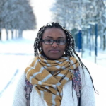
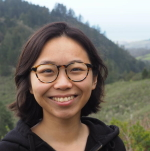
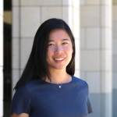

The MD4SG initiative will give a tutorial at the [Data Science Africa Summer School](http://www.datascienceafrica.org/dsa2020kampala/schedule/#session-papers) (DSA'20), showcasing work focused on and relevant to the African continent, as presented by the leaders of different MD4SG working groups. The MD4SG online working groups have served as a backbone of MD4SG over the years, fostering interdisciplinary work, and bridging research and practical applications focused on improving access to opportunity in disadvantaged and marginalized communities.

The tutorial is taking place on July 29th, 9 - 11 AM EAT. Registration information can be found on the [Data Science Africa](http://www.datascienceafrica.org/dsa2020kampala/logistics/) website.

Working Group Presentations
---------------------------

### Environment and Climate Change

The climate crisis negatively impacts vulnerable populations the most. The *environment and climate working group* focuses on potential solutions that require interdisciplinary input (teamwork) in order to improve the welfare of these vulnerable communities. In this talk, we will overview our group's mission and highlight research opportunities at the intersection of data science, mechanism design, and sustainable development policy, especially in the African context.

_Presentation by Wanyi Li and Lily Xu._

### Global Perspectives on Inequality

The global perspectives on *inequality working group* seeks to combine economics, machine learning, and optimization perspectives to understand the causes and solutions to resource disparities. This year, the group has focused on two fundamental questions: when should we provide a resource to the vulnerable, and how do we identify worthy recipients? This talk will discuss some standard approaches to these problems, and highlight new dimensions from the group's own research.

_Presentation by Samuel Taggart._

### Developing Nations

The *Development* working group fosters collaboration and discussion amongst practitioners and academics to understand and tackle issues pertaining to the role and application of technology in addressing challenges in emerging nations and under-resourced settings. We study how techniques from algorithm and mechanism design, computational social science, and optimization can inform and help advance existing development policies and practices. In this talk, we'll give an overview of ongoing research within the group, and delve into a current project aimed at optimising COVID testing strategies in resource-constrained settings.

_Presentation by Francisco Marmolejo-Cossio._

### Data Economies & Data Governance

The *Data Economies* working group within MD4SG is composed of a vibrant group of researchers and practitioners who are either based in or lead networks of research across the African continent. The group currently has two ongoing projects: Data Sharing and Data Platform. While the Data Sharing project explores nuanced barriers, including issues of trust, uneven power dynamics, and data colonialism that pose challenges to data sharing across the continent, the Data Platform project is working to deploy a data browser tool that will offer a platform for African scholars and practitioners to share, host, and visualise their data.

_Presentation by Abeba Birhane and George Obaido._

## Speakers and Organizers

### Rediet Abebe, Harvard University

[Rediet Abebe](https://www.cs.cornell.edu/~red/) is a Junior Fellow at the Harvard Society of Fellows and an incoming Assistant Professor at the University of California, Berkeley. Her research is broadly in algorithms and AI, with a focus on equity and justice concerns. Abebe holds a Ph.D. in computer science from Cornell University as well as an M.S. and a B.A. in mathematics from Harvard University and an M.A. in mathematics from the University of Cambridge. She was recently named one of [35 Innovators Under 35](https://www.technologyreview.com/innovator/rediet-abebe/) by the MIT Technology Review, in part for her work with MD4SG. Her research is deeply informed by her upbringing in Ethiopia. Abebe co-founded and has been co-organizing the MD4SG initiative since fall 2016.

### Abeba Birhane, University College Dublin & Lero

[Abeba Birhane](https://abebabirhane.wordpress.com/) is a Ph.D. candidate in cognitive science at the school of computer science at University College Dublin, Ireland & Lero — the Irish software research centre. Her research explores questions of ethics, justice, and bias that arise with the design, development, and deployment of artificial intelligence.

### Wanyi Li, Stanford University

[Wanyi Li](https://web.stanford.edu/~wanyili/) is a Ph.D. candidate in operations management at Stanford University Department of Management Science and Engineering. She studies market design for environmental conservation. In particular, she builds theoretical frameworks for contracts and incentive schemes to protect forests and to improve smallholding farmers' livelihood. She is a recipient of the Stanford Interdisciplinary Graduate Fellowship (2018 - 2021). Prior to Stanford, she received her B.A. in Physics from Wellesley College. She grew up in Xuzhou, China and has lived in India for two years. She has been co-organizing the MD4SG Environment/Climate working group since spring 2020.

### Irene Lo, Stanford University

[Irene Lo](https://sites.google.com/view/irene-lo) is an assistant professor in the department Management Science & Engineering at Stanford University. She researches how to design matching markets and assignment processes to improve market outcomes. In her work, she focuses on public sector applications and socially responsible operations research. She received her undergraduate degree from Princeton University and her PhD in Industrial Engineering & Operations Research from Columbia University, and was a postdoctoral scholar in the Economics department at Stanford University. She has been co-organizing the MD4SG initiative since fall 2018.

### Francisco Marmolejo-Cossio, University of Oxford

[Francisco J. Marmolejo Cossio](https://www.fmarmolejo.com/) is a Career Development Fellow in Computer Science at Balliol College within the University of Oxford. He is also a Research Fellow at Input Output Hong Kong (IOHK). His research lies at the intersection of Algorithmic Game Theory, Decentralised Consensus Protocols and Computational Learning Theory. Francisco holds a D.Phil. in Computer Science and an M.Sc. in Mathematics and Foundations of Computer Science from the University of Oxford, as well as a B.A. in Mathematics from Harvard University. Francisco is originally from San Luis Potosi, Mexico. Francisco has also been co-organizing the MD4SG initiative as a whole since Spring 2020.

### George Obaido, University of Witwatersrand

[George Obaido](https://georgeobaido.com/) is a research associate at the University of the Witwatersrand and the University of Johannesburg in South Africa. His research interests lie in using natural language processing techniques to find solutions to problems of societal importance. He completed his PhD in Computer Science at the University of the Witwatersrand in Johannesburg, South Africa, under the guidance of Prof Abejide Ade-Ibijola and Dr Hima Vadapalli. He also obtained his MSc in Computer Science from the University of the Witwatersrand.

### Ana-Andreea Stoica, Columbia University

[Ana-Andreea Stoica](http://www.columbia.edu/~as5001/) is a Ph.D. candidate at Columbia University. Her work focuses on mathematical models, data analysis, and policy implications for algorithm design in social networks. From recommendation algorithms to the way information spreads in networks, Ana is particularly interested in studying the effect of algorithms on people's sense of privacy, community, and access to information and opportunities. Ana grew up in Bucharest, Romania, and moved to the US for college, where she graduated from Princeton in 2016 with a bachelor's degree in Mathematics. She has been co-organizing the MD4SG initiative since fall 2019.

### Sam Taggart, Oberlin College

[Sam Taggart](http://samueltaggart.com/) is assistant professor of computer science at Oberlin College. He is co-organizer of the Mechanism Design for Social Good working group on inequality. His research interests lie at the intersection of theoretical computer science and microeconomic theory. Specific interests include applications of tools from mechanism design, statistical learning, and theoretical computer science to problems of social import, the interaction between economic incentives and statistical learning and in obtaining theoretical performance guarantees for practical resource allocation protocols such as the first-price auction. He holds a PhD in Computer Science from Northwestern University.

### Lily Xu, Harvard University

[Lily Xu](https://lily-x.github.io/) is a Ph.D. student in computer science at Harvard University, advised by Milind Tambe. Her research applies artificial intelligence, specifically online learning and game theory, to wildlife conservation. She has focused on the prevention of illegal wildlife poaching and deployed her work in a protected area in Cambodia. Lily received her bachelor's degree from Dartmouth College in 2018, where she studied computer science and Spanish. She has been serving as a co-organizer of the MD4SG Environment/Climate working group since spring 2020.