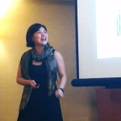

- - -
This [tutorial](https://ec20.sigecom.org/program/workshops-tutorials/) will bring to bear tools from economics and computer science on a core problem of social good: provision of goods to vulnerable populations. By definition, forms of vulnerability such as poverty preclude access to goods through normal market channels. Without intervention, this can be ruinous individually and greatly suboptimal socially. Universal provision is one often-touted solution, but can be costly and inefficient. Consequently, more targeted approaches are common, but must contend with lack of priors about the population of interest. We survey the rich mechanism design and machine learning questions inherent in the most prevalent approaches to this unique resource allocation problem and suggest directions for future work from the EC community.

Topics:
*   Session 1A: Introduction. Targeting Toolbox. Proxy Means Testing. Community-Based Targeting. \[[**Video**](https://www.youtube.com/watch?v=M6pL9EosUUY), [**Slides**](../../assets/events/ec2020/MD4SGEC1a.pdf)\]
*   Session 1B: Self-targeting. Ordeal-based targeting. In-kind provision. \[[**Video**](https://www.youtube.com/watch?v=YxWSNwq2SEo), [**Slides**](../../assets/events/ec2020/MD4SGEC1b.pdf)\]
*   Session 2A: Consequences of behavioral theories. \[[**Video**](https://www.youtube.com/watch?v=1GpbpVQaPZc), [**Slides**](../../assets/events/ec2020/MD4SGEC2a.pdf)\]
*   Session 2B: Algorithmic issues in information acquisition. Strategic classification. Bayesian learning in networks. \[[**Video**](https://www.youtube.com/watch?v=j9Ld5toSt7I), [**Slides**](../../assets/events/ec2020/MD4SGEC2b.pdf)\]

## Logistics
- - -
### Target Audience
The tutorial will be self-contained, and designed for students and researchers in computer science and economics without assuming previous knowledge of public / social service provision. It will emphasize applications of tools from machine learning and mechanism design in promoting social good. The audience will be exposed to potentially new models from economics and theoretical computer science which capture key issues in provision. The discussion of empirical work will illustrate the complexities of practical implementation, highlight the importance of experimentation to understanding relevant factors for vulnerable populations in particular, and suggest potential for further theoretical work.

Pre-recording will take place over the course of two days.
- Session 1: Thursday June 25, 11-11:45am and 12-12:45pm Eastern
- Exercise Session: Thursday June 25, 3-4pm Eastern
- Session 2: Friday June 26, 11-11:45am and 12-12:45pm Eastern

EC tutorial watch parties will take place on July 13.

### Registration

You have to register for the [ACM EC Conference](https://ec20.sigecom.org/) to participate in this tutorial. Please register [here](https://ec20.sigecom.org/participation/registration/). Note, registration is free with a SIGecom membership ($5 for students and $10 for others).

### References

Session 1A:
*   Adams, Alayne M., Timothy G. Evans, Rafi Mohammed, and Jennifer Farnsworth. "Socioeconomic stratification by wealth ranking: Is it valid?." _World Development_ (1997)
*   Alatas, Vivi, Ririn Purnamasari, Matthew Wai-Poi, Abhijit Banerjee, Benjamin A. Olken, and Rema Hanna. "Self-targeting: Evidence from a field experiment in Indonesia." _Journal of Political Economy_ (2016)
*   Alatas, Vivi, Abhijit Banerjee, Rema Hanna, Benjamin A. Olken, and Julia Tobias. "Targeting the poor: evidence from a field experiment in Indonesia." _American Economic Review_ (2012)
*   Alderman, Harold. "Do local officials know something we don't? Decentralization of targeted transfers in Albania." _Journal of Public Economics_ (2002)
*   Currie, Janet, and Firouz Gahvari, "Transfers in cash and in-kind: Theory meets the data." _Journal of Economic Literature_ (2008)
*   Dworczak, Piotr, Scott Duke Kominers, and Mohammad Akbarpour. "Redistribution through Markets." EC (2018)
*   Hanna, Rema, and Benjamin A. Olken. "Universal basic incomes versus targeted transfers: Anti-poverty programs in developing countries." _Journal of Economic Perspectives_ (2018)
*   Karlan, Dean, and Bram Thuysbaert. "Targeting ultra-poor households in Honduras and Peru." _The World Bank Economic Review_ (2019).

Session 1B:
*   Alatas, Vivi, Ririn Purnamasari, Matthew Wai-Poi, Abhijit Banerjee, Benjamin A. Olken, and Rema Hanna. "Self-targeting: Evidence from a field experiment in Indonesia." _Journal of Political Economy_ (2016)
*   Kleven, Henrik Jacobsen, and Wojciech Kopczuk. "Transfer program complexity and the take-up of social benefits." _American Economic Journal: Economic Policy_ (2011)
*   Mkandawire, Thandika. "Targeting and universalism in poverty reduction." United Nations Research Institute for Social Development. (2005)

Session 2A:
*   Bhargava, Saurabh, and Dayanand Manoli. "Psychological frictions and the incomplete take-up of social benefits: Evidence from an IRS field experiment." _American Economic Review_ (2015)
*   Carvalho, Leandro S., Stephan Meier, and Stephanie W. Wang. "Poverty and economic decision-making: Evidence from changes in financial resources at payday." _American Economic Review_ (2016)
*   Dohmen, Thomas, Armin Falk, David Huffman, Uwe Sunde, Jurgen Schupp, and Gert G. Wagner. "Individual risk attitudes: Measurement, determinants, and behavioral consequences." _Journal of the European Economic Association_ (2011)
*   Falk, Armin, Anke Becker, Thomas Dohmen, Benjamin Enke, David Huffman, and Uwe Sunde. "Global evidence on economic preferences." _The Quarterly Journal of Economics_ (2018)
*   Fong, Christina M., and Felix Oberholzer-Gee. "Truth in giving: Experimental evidence on the welfare effects of informed giving to the poor." _Journal of Public Economics_ (2011)
*   Haushofer, Johannes, Daniel Schunk, and Ernst Fehr. "Negative income shocks increase discount rates." Working paper. (2019)
*   Incekara-Hafalir, Elif, and Sera Linardi. "Awareness of low self-control: Theory and evidence from a homeless shelter." _Journal of Economic Psychology_ (2017).
*   Linardi, Sera, and Nita Rudra. "Globalization and Willingness to Support the Poor in Developing Countries: An Experiment in India." _Comparative Political Studies_ (2020)
*   Mani, Anandi, Sendhil Mullainathan, Eldar Shafir, and Jiaying Zhao. "Poverty impedes cognitive function." _Science_ (2013)
*   Madrian, Brigitte C., and Dennis F. Shea. "The power of suggestion: Inertia in 401 (k) participation and savings behavior." _The Quarterly Journal of Economics_ (2001)
*   Petersen, Michael Bang, Daniel Sznycer, Leda Cosmides, and John Tooby. "Who deserves help? Evolutionary psychology, social emotions, and public opinion about welfare." _Political Psychology_ (2012)
*   Tanaka, Tomomi, Colin F. Camerer, and Quang Nguyen. "Risk and time preferences: Linking experimental and household survey data from Vietnam." _American Economic Review_ (2010)

Session 2B:
*   Alatas, Vivi, Abhijit Banerjee, Arun G. Chandrasekhar, Rema Hanna, and Benjamin A. Olken. "Network structure and the aggregation of information: Theory and evidence from Indonesia." _American Economic Review_ (2016).
*   Alatas, Vivi, Abhijit Banerjee, Rema Hanna, Benjamin A. Olken, and Julia Tobias. "Targeting the poor: evidence from a field experiment in Indonesia." _American Economic Review_ (2012)
*   Blundell, Richard, and Hilary W. Hoynes. "Has' In-Work' Benefit Reform Helped the Labor Market?" In _Seeking a Premier Economy: The Economic Effects of British Economic Reforms, 1980-2000_, University of Chicago Press (2004).
*   Friedberg, Leora. "The labor supply effects of the social security earnings test." _Review of Economics and Statistics_ (2000)
*   Hardt, Moritz, Nimrod Megiddo, Christos Papadimitriou, and Mary Wootters. "Strategic classification." ITCS (2016).
*   Hu, Lily, Nicole Immorlica, and Jennifer Wortman Vaughan. "The disparate effects of strategic manipulation." FAT\* (2019)
*   Maestas, Nicole, Kathleen J. Mullen, and Alexander Strand. "Does disability insurance receipt discourage work? Using examiner assignment to estimate causal effects of SSDI receipt." _American Economic Review_ (2013)
*   Milli, Smitha, John Miller, Anca D. Dragan, and Moritz Hardt. "The social cost of strategic classification." FAT\* (2019).

### Organizers

### Sera Linardi, University of Pittsburgh

[Sera Linardi](http://www.linardi.gspia.pitt.edu/) is an experimental economist and an associate professor of Economics at Graduate School of Public and International Affairs at the University of Pittsburgh. She holds a PhD in Social Science from California Institute of Technology and is the founding director of Center for Analytical Approaches to Social Innovation (CAASI), which builds interdisciplinary research teams to work on practical problems faced by organizations. She is a co-organizer of the 2020 NSF/CEME Decentralization conference on Mechanism Design for Vulnerable Populations. Her research focuses on the two ends of service provision: donor altruism and client utilization, with field experiments on homelessness and reintegration services. She is currently funded by the NSF, Heinz Foundation, Rapoport Foundation, and the Integrative Social Science Research Initiative.

Email: [linardi@pitt.edu](linardi@pitt.edu)

### Sam Taggart, Oberlin College

[Sam Taggart](http://samueltaggart.com/) is assistant professor of computer science at Oberlin College. He is co-organizer of the Mechanism Design for Social Good working group on inequality. His research interests lie at the intersection of theoretical computer science and microeconomic theory. Specific interests include applications of tools from mechanism design, statistical learning, and theoretical computer science to problems of social import, the interaction between economic incentives and statistical learning and in obtaining theoretical performance guarantees for practical resource allocation protocols such as the first-price auction. He holds a PhD in Computer Science from Northwestern University.

Email: [samuelptaggart@gmail.com](samuelptaggart@gmail.com)

**Support**: [Rediet Abebe](http://www.cs.cornell.edu/~red/), [Irene Lo](https://sites.google.com/view/irene-lo), and [Ana-Andreea Stoica](http://www.columbia.edu/~as5001/)