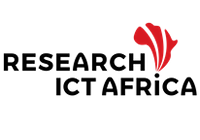

As machine learning and data science applications grow ever more prevalent, the search for quality data has also increased. The Global South plays a central role in the global data landscape -- from being the target for “untapped” data mining, to contributing to the bulk of data labelling (ghost work) labour, to driving data sharing practices across the globe. And yet, the relationship between data science researchers, practitioners, NGO’s, and communities in the Global South and the rest of the global data science ecosystem is often marked with significant power asymmetries, histories and legacies of colonialism, lack of trust, and _deficit narratives_ which frequently portrays the Global South in a negative light. There is insufficient understanding of the data practices of this hemisphere by those in the Global North, and in the process research for and by researchers in the Global South is also overlooked.  

This project aims to critically examine and shed light on the complex data ecosystem in the Global South -- and to do so in a manner that centers the stories, research, and practices of those from the region. We do so with an especial focus on the African continent and the Middle East and North African (MENA) region. We examine questions such as “Who benefits from data sharing?”, “Who are the omitted stakeholders in the data ecology?”, and “How can data practices be carried out in a manner that pays back to communities where data is extracted from?”. Our work is conducted by researchers and practitioners across the globe and done in collaboration with researchers, data scientists, non-profit organizations, and government organizations focused on improving our understanding of the data landscape and removing data inequities in their many forms.

### Research Outputs

*   **Narratives and Counternarratives on Data Sharing in Africa**  
    Rediet Abebe, Kehinde Aruleba, Abeba Birhane, Sara Kingsley, George Obaido, Sekou Remy, and Swathi Sadagopan  
    _[ACM Conference on Fairness, Accountability, and Transparency (ACM FAccT '21)](https://dl.acm.org/doi/10.1145/3442188.3445897)_  
    Preliminary versions in:  
    
    *   _ACM Conference on Collective Intelligence (CI '20);_
    *   _Privacy Law Scholars Conference (PLSC '20);_
    *   _Contested Data Academic Workshop at Data & Society (D&S '20);_
    *   _Machine Learning for Development Workshop (ML4D'19)_.
    
*   **Data Browser: MD4SG Platform**  
    Rediet Abebe, Kehinde Aruleba, Jasmine Jones, Sara Kingsley, Aatish Neupane, Bikalpa Neupane, George Obaido, and Swathi Sadagopan  
    Preliminary version by Bikalpa Neupane, Aatish Neupane, Sara Kingsley and Swathi Sadagopan appears in MD4SG Workshop at EC '19.
  
*   **Responsible AI in Africa Book Chapter**  
    Kehinde Aruleba, Abeba Birhane, George Obaido and Chinasa Okolo  
    This current project is ongoing.  

### Research Projects

#### MD4SG Data Browser

MD4SG dataset browser is a web application that has been developed to help users quickly find MD4SG related datasets. It allows users to browse through listed datasets, filter them by various criteria, and even provide capabilities for users to suggest new datasets. The data browser is for everyone who wants to:

*   learn more about different kinds of data,
*   visualize data per location, and
*   access data for research purposes.

#### Data Practices in Africa

In the past, we have focused on data sharing throughout the African continent and examined the social, historical, structural, and infrastructural obstacles that posed a challenge to equitable data sharing practices. Our ongoing projects include exploring responsible AI in Africa, critical investigations into the data collection pipeline, as well as the underpaid and overexploited "market" of data labelling. A list of African scholarship related to this work is provided in this [link](https://docs.google.com/spreadsheets/d/1Fj9TM-PtHXOiLV9wWGBmKMjBtuulYDRqTNMjU2LIWOA/edit#gid=0).

### Events

#### CRAFT Session

Our FAccT 2021 CRAFT session, "Narratives and Counternarratives on Data Practices in the Global South," is an interactive workshop that uses storytelling as a method to question common assumptions around data practices in countries and communities that are often grouped as "the Global South." Building on our current project around data sharing in Africa, — and our own autoethnographic observations in other countries — we will provide various theme-based stories that are informed by common narratives around data practices and invite participants to challenge these narratives from various angles including historical contexts and cultures, legal limitations, accessibility, impact assessments, accountability mechanism, and more.

Our post-conference plan is to create "Narratives and Counternarratives on Data Practices in the Global South" story cards. Our hope is that these cards then will be used by data science educators, civil society groups, philanthropic groups, inter-governmental organizations such as the UN agencies, and technology companies to expose them to narratives and counternarratives of data practices in the Global South and inform them about challenges before they embark on any new initiatives.

### Related Projects and Initiatives
|   |   |   |   |
|---|---|---|---|
|  |  |  |  |
|  |  |  |  |
|  | | | |

### Contact Us

We want to work closely with people in this area and partnering with policy-makers and researchers on the continent. To contact members of this project, please use the form provided in this [link](https://docs.google.com/forms/d/e/1FAIpQLSdGxU8NdrI_rA6tTsgOihjKmX_e9FtejlrAO6hn5zb7JXseLw/viewform).