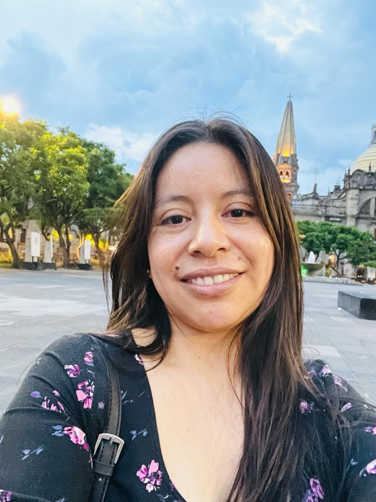
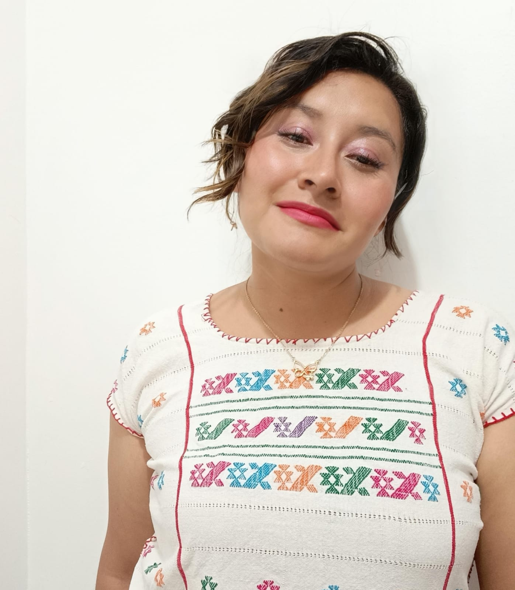
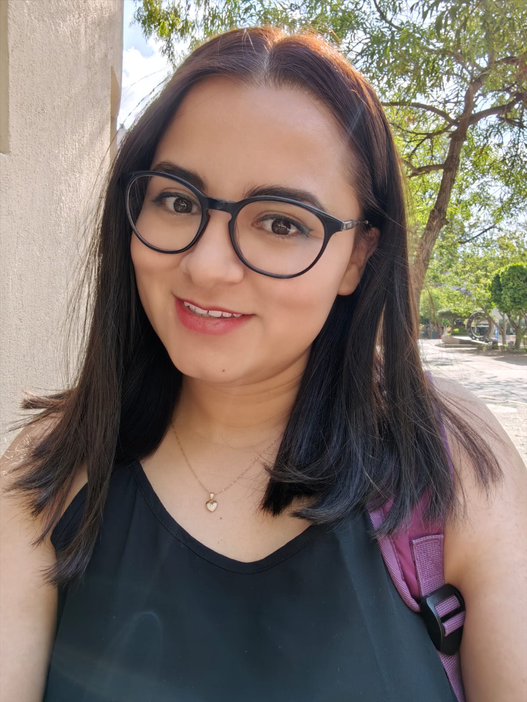
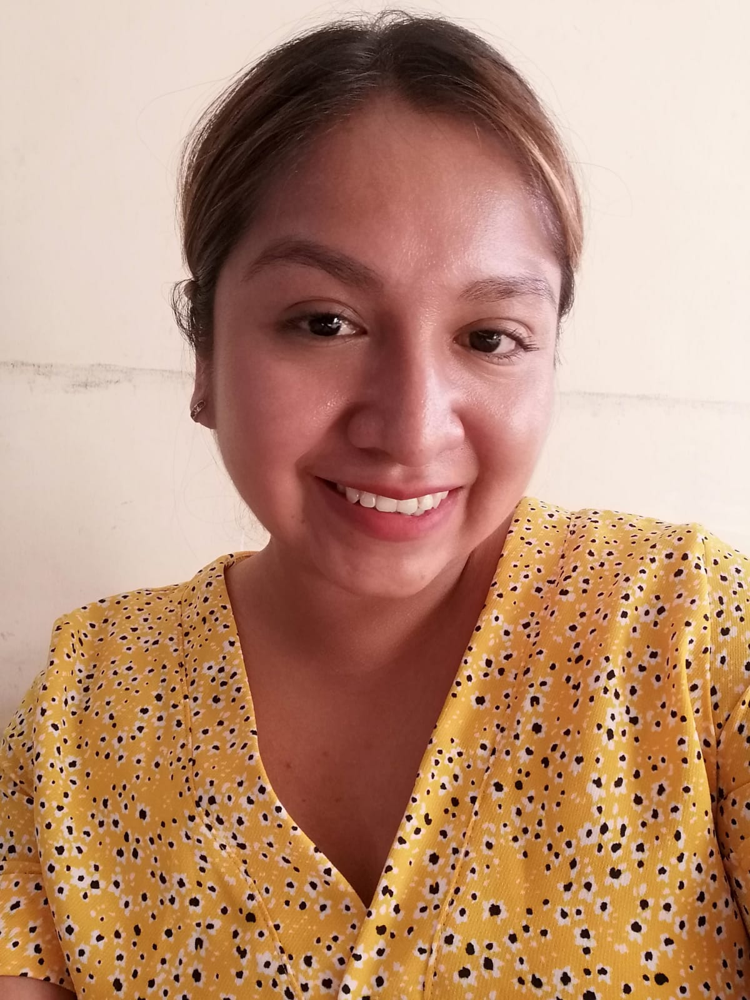
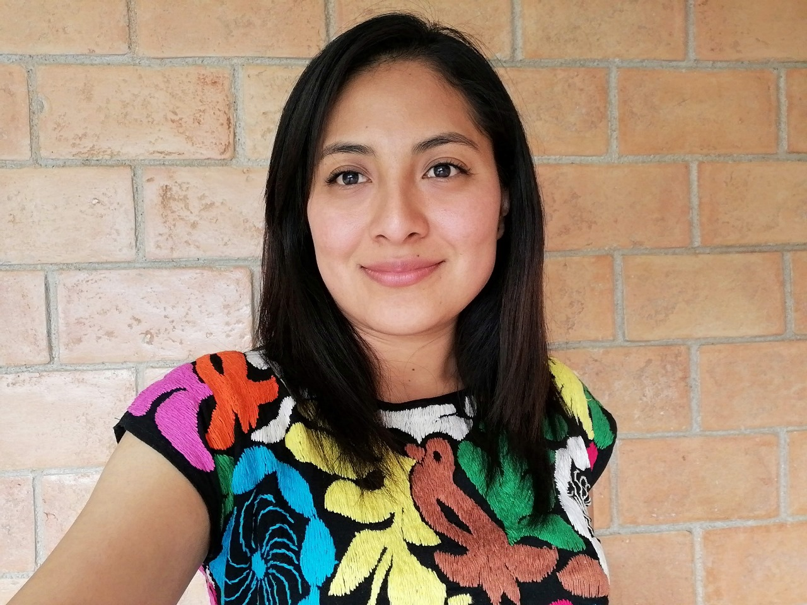
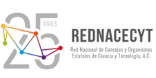

## Overview

The goal of the Summer of Science Program is to support female students from indigenous communities in Mexico as they design and execute research projects aimed at improving their local communities. Applicants to the program are students at various levels of postgraduate education, and they prepare proposals aimed at using techniques from algorithms, optimization, and mechanism design, along with insights from the social sciences and humanistic studies to address relevant issues in their communities. Students who are accepted to the program are paired with mentors from MD4SG to work through their projects over the Summer. The end deliverable of this collaboration between mentors and students is a poster presentation which the students give at the Association of Computing Machinery ([ACM](https://www.acm.org/)) Conference on Equity and Access in Algorithms, Mechanisms, and Optimization ([EAAMO](https://eaamo.org/)).

The previous iteration of the program, the ["COPOCYT-MD4SG Summer of Science"](https://eaamo.org/copocyt/) accepted 8 female indigenous students from the Huasteca region of San Luis Potosí, Mexico to present posters at EAAMO '22 which took place at George Mason University in the United States. The students were from Tének and Nahuatl-speaking communities and their projects spanned the broad themes of: preservation of indigenous language/culture, affordable housing, and equitable access to healthcare for indigenous communities.

This year's Summer of Science Program is a partnership between the Mechanism Design for Social Good (MD4SG) research initiative and the National Network of Councils and State Organizations of Science and Technology ([REDNACECYT](https://www.rednacecyt.org/)).

We are thrilled to announce that **this year we have accepted 20 female students overall from the states of Michoacán, Sinaloa, Chihuahua, Estado de México, Veracruz, Puebla y San Luis Potosí. The students are members of 11 indigenous communities overall (Cuanajo, Purépecha, Mixteco, Tepehuan, Rarámuri, Mazahua, Zapoteca, Náhuatl, Tének, Mazateca and Zoque)**. The projects proposed by these students cover a wide array of topics, including (amongst others): understanding and improving collective decision-making in indigenous communities, preserving indigenous culture and identity, providing equitable healthcare and housing, and understanding perceptions of environmental policy in local indigenous communities.

## Timeline/Program

*   June - July: Call for proposals published by REDNACECYT
*   Late July: Students are notified on whether their proposals are accepted to Summer of Science
*   Early August: Students are paired with mentors from MD4SG
*   Early August - Mid October: Students meet regularly with MD4SG mentors and prepare poster for presentation at EAAMO '23
*   Mid September: Information session with Fullbright program officers regarding scholarship opportunities in the U.S.A.
*   October 30 - November 1st: Participation at EAAMO '23 at Boston University
    *   Poster session date/time TBA
*   November 2nd: Summer of Science workshop to be held at Harvard University
    *   Events include: seminars and tutorials from researchers at Harvard University, guided visit of the University, visits to research labs, and social events with students and student groups. Further details to be announced closer to the date.

## 2023 Cohort

### María Guadalupe García Alonso

**State**: Michoacán  
**Student Status** Student of Master of Science in Rural Development at U. Autónoma de Chapingo  
**Project Overview**: Perception and social participation in the environmental restoration programs of the basin of Lake Patzcuaro, Michoacán  
**Supervisor**: Diego M. Macall  
**Indigenous Community**: Cuanajo

### Viridiana Camacho Pánfilo

**State**: Michoacán  
**Student Status**: In the process of admission to postdoctoral program  
**Project Overview**: The Purépecha Indians and the status of father of a family. The actors and the political practice of the Purépecha peoples of Michoacán in the first half of the 19th century.  
**Supervisor**: Francisco Marmolejo-Cossio  
**Indigenous Community**: Purépecha

### María Rosario Niniz Silva

**State**: Michoacán  
**Student Status**: PhD student in Social Sciences in Rural Studies at El Colegio de Michoacán  
**Project Overview**: Acquired disability, family dynamics and gender repositioning in a context of transnational migration. The case of Purépecha migrants in the United States  
**Supervisor**: Agnes Medinaceli  
**Indigenous Community**: Purépecha

### Ofelia López Mejía

**State**: Sinaloa  
**Student Status**: Postdoctoral student in Law Sciences at the Autonomous University of Sinaloa  
**Project Overview**: Indigenous women and political representation in the municipality of Elota, Sinaloa  
**Supervisor**: Flor Gerardou and Blanca Moran  
**Indigenous Community**: Mixteco

### Rosa Adriana Rivas Castillo

**State**: Chihuahua  
**Student Status**: Bachelor's student intending to pursue a master's degree next year  
**Project Overview**: Impact of violence on mental health for the Rarámuris women of the Sierra Tarahumara in Chihuahua  
**Supervisor**: Alejandro Quiroz  
**Indigenous Community**: Tarahumara y Tepehuan

### Argelia Contreras Aguirre

**State**: Chihuahua  
**Student Status**: Admitted to the master's degree in Intercultural Education from the National Pedagogical University of Chihuahua  
**Project Overview**: Address some needs around artistic education  
**Supervisor**: Cristina Gorrostieta  
**Indigenous Community**: Rarámuri

### Alma Benita Cruz González

**State**: Estado de México  
**Student Status**: Master's student in Social Medicine  
**Project Overview**: Traditional medicine in the health services of CESSA, Amealco, through intercultural health.  
**Supervisor**: Alicia Prieto Langarica  
**Indigenous Community**: Mazahua

### Flor Ángel Pérez Sánchez

**State**: Veracruz  
**Student Status**: In the process of admission to a Master's Degree in Tropical Ecology at CITRO  
**Project Overview**: Socio-environmental perception of the Tehuantepec Isthmus Interoceanic Corridor project in the Ubero to Mogoñe section, Oaxaca.  
**Supervisor**: Tilsa Oré Mónago  
**Indigenous Community**: Zapoteca

### Yasmín Cruz Cruz

**State**: Veracruz  
**Student Status**: Master's student in Administrative Engineering at TNM  
**Project Overview**: Development of a mobile application and analysis with data mining for the detection of the autism spectrum  
**Supervisor**: Santiago Correa Cardona  
**Indigenous Community**: Náhuatl

### Yésica Gómez Hernández

**State**: Puebla  
**Student Status**: In the process of admission to the Doctorate in Educational Research at the Autonomous University of Tlaxcala  
**Project Overview**: Being a woman, indigenous and scientific: an analysis of academic and professional trajectories based on ethnic, linguistic and gender conditions.  
**Supervisor**: Dr. Angel Garcia  
**Indigenous Community**: Náhuatl

### Edna Marlene Martínez Hernández

**State**: San Luis Potosí  
**Student Status**: Student of the Master of Science in Public Health at UANL  
**Project Overview**: Communication barriers and challenges in health education about COVID-19 in indigenous communities of the Huasteca Potosina.  
**Supervisor**: Michelle González Amador  
**Indigenous Community**: Tének

### Leydi Rojas Martínez

**State**: San Luis Potosí  
**Student Status**: Student of the Master of Science in Public Health at UANL  
**Project Overview**: Accessibility to health services during the COVID-19 pandemic in indigenous communities of the Huasteca Potosina.  
**Supervisor**: Salvador Ruiz Correa  
**Indigenous Community**: Tének

### Anai Domingo Martínez

**State**: San Luis Potosí  
**Student Status**: Master's student in Public Health at UASLP  
**Project Overview**: An met'antalab, ¿jant'ey a exlal?: evaluation of an educational intervention for indigenous adolescents about the level of knowledge about the Human Papilloma Virus.  
**Supervisor**: Lucas Gomez Tobon  
**Indigenous Community**: Tének

### María Guadalupe Márquez Hinojosa

**State**: San Luis Potosí  
**Student Status**: Master's student in Public Health at UASLP  
**Project Overview**: Level of knowledge about HPV in a Nahuatl-speaking indigenous population after an educational intervention  
**Supervisor**: Dra. Areli Vázquez Juárez  
**Indigenous Community**: Tének

### Iridiana Salinas Hernández

**State**: San Luis Potosí  
**Student Status**: Master's student in Accounting at UANL  
**Project Overview**: Economic inequality is an obstacle to a better quality of life in the families of the community of Itztacapa Xilitla S.L.P.  
**Supervisor**: Imelda Flores Vazquez  
**Indigenous Community**: Náhuatl

### Idalia Rojas Martínez

**State**: San Luis Potosí  
**Student Status**: In the process of admission to the specialty in advanced clinical nursing  
**Project Overview**: Inclusion of mother tongue-speaking nurses for the care of indigenous peoples of the Huasteca Potosina in the second and third level of care  
**Supervisor**: Alejandro Robinson-Cortés  
**Indigenous Community**: Tének

### Claudia Martínez Martínez

**State**: San Luis Potosí  
**Student Status**: Master's student in International Relations at UANL  
**Project Overview**: The perception of indigenous women from the Huasteca Zone in the Tének Region, S. L. P. regarding access to higher education in Mexico  
**Supervisor**: Rubén Martínez Cárdenas  
**Indigenous Community**: Tének

### Adriana Santiago Marcelino

**State**: San Luis Potosí  
**Student Status**: Master's degree in Human Rights at UASLP  
**Project Overview**: Evaluation of the rights of children in Education and health in the indigenous community  
**Supervisor**: Rubén Martínez Cárdenas  
**Indigenous Community**: Tének  

### Celeste Cristal Flores Cuevas

**State**: San Luis Potosí  
**Student Status**: Graduated from the master's degree in sustainable water management at El Colegio de San Luis  
**Project Overview**: Between community and cultural management of water in Loma Chapultepec, Huautla, Oaxaca  
**Supervisor**: Egidio Tentori  
**Indigenous Community**: Mazateca

### Martha Yadira Jiménez Estrada

**State**: Chiapas  
**Student Status**: Master's student in Intercultural Studies  
**Project Overview**: Through my project "Orality: Biocultural Heritage of the Zoques," I aim to create bilingual stories in both Zoque and Spanish, using written and audio-visual formats, to preserve our community's oral traditions and encourage language learning, thereby enriching our cultural heritage.  
**Supervisor**: María Ana Chavana Villalobos and Jorge Garcia Ponce  
**Indigenous Community**: Zoque

## Organizing Team and Mentors

The following mentors are also the main organizing team from MD4SG facilitating the Summer of Science program.

*   [Dr. Francisco Marmolejo Cossío](https://www.fmarmolejo.com/), Harvard University
*   [Dra. Tilsa Ore Monago](https://tilsaore.github.io/), Rice University
*   [Dra. Imelda Flores Vazquez](https://www.linkedin.com/in/dr-imelda-flores-vazquez-1a3262171/), Econometrica Inc.
*   [Michelle González-Amador](https://www.merit.unu.edu/about-us/profile/?staff_id=2422), UNU-MERIT and Maastricht University
*   [Dr. Rubén Martínez Cárdenas](https://www.dmu.ac.uk/about-dmu/academic-staff/business-and-law/ruben-martinez-cardenas/ruben-martinez-cardenas.aspx), University of York

Full list of mentors:

*   [Dr. Alejandro Robinson-Cortés](https://www.robinson-cortes.com/), University of Essex
*   [Prof. Salvador Ruiz Correa](https://scholar.google.com/citations?user=LJNs7nwAAAAJ&hl=en), Potsinian Institute of Scientific Research and Technology (IPICYT)
*   [Prof. Alicia Prieto Langarica](https://ysu.edu/people/alicia-prieto-langarica), Youngstown State University
*   [Diego M. Macall](https://diegomacall.github.io/), Universitat Autònoma de Barcelona
*   [Prof. Areli Vázquez Juárez](https://www.researchgate.net/profile/Areli-Vazquez-Juarez), National Autonomous University of Mexico (UNAM)
*   [Agnes Medinaceli](https://www.bu.edu/gdp/profile/agnes-medinaceli/), University of Oxford
*   [Jorge Garcia Ponce](https://www.linkedin.com/in/jorge-garc%C3%ADa-ponce-33a8aa210), Harvard University
*   [Dr. Egidio Tentori](https://www.researchgate.net/profile/Egidio-Tentori), Cornell University
*   [Dr. Flor Gerardou](https://www.falmouth.ac.uk/staff/dr-flor-gerardou), Falmouth University
*   [Dr. Blanca Moran](https://www.shu.ac.uk/about-us/our-people/staff-profiles/blanca-guizar-moran#secondSection), Sheffield Hallam University
*   [Dr. Angel Urbina Garcia](https://www.hull.ac.uk/staff-directory/angel-urbina-garcia), University of Hull
*   [Dr. Eleanor Brown](https://www.york.ac.uk/education/our-staff/academic/eleanor-brown/), University of York
*   [Dr. María Ana Chavana Villalobos](https://www.linkedin.com/in/maria-ana-chavana-villalobos-58044a13/?originalSubdomain=uk), University of York
*   [Dr. Santiago Correa Cardona](https://santiagocorrea.github.io/), University of Massachusetts
*   [Dr. Cristina Gorrostieta](https://www.linkedin.com/in/cristina-gorrostieta-hurtado-67774649), Cogito
*   [Prof. Alejandro Quiroz](https://www.essex.ac.uk/people/quiro05609/alejandro-quiroz-flores), University of Essex
*   [Lucas Gomez Tobon](https://co.linkedin.com/in/lucasgomeztobon), Quantil

## REDNACECYT

The National Network of Councils and State Organizations of Science and Technology, A.C., known as REDNACECYT, was established on November 23, 1998, in Guanajuato by Coahuila, Durango, Guanajuato, Michoacán, Querétaro, San Luis Potosí, Sinaloa, and Tamaulipas.

REDNACECYT has played a significant role in advancing science, technology, and innovation in Mexico. It serves as an organization that unites diverse entities with a shared focus on these areas. It stands out not only for fostering collaboration among entities with distinct objectives related to science, technology, and innovation, but also for actively shaping policies and their application to development in coordination with federal entities.

Initially, REDNACECYT was formed as a platform for discussing programs and initiatives that promote scientific research, technological development, and innovation at the federal level. It facilitates interactions among members and fosters coordination with academia, government, social, and business sectors to shape public policies.

In its early years, REDNACECYT concentrated on national discussions, particularly on federal and state legislation related to science and technology. Over time, it shifted its focus toward federalizing the promotion of scientific and technological activities, maintaining a continuous exchange of best practices and driving the establishment of new councils and similar bodies.

Sinceits inception, REDNACECYT has steadily grown its membership and actively engaged in a wide array of forums. This engagement spans governmental agencies, legislative and executive bodies, federal and state powers, as well as non-governmental organizations.

As REDNACECYT reaches its 20th anniversary, amid a dynamic national and global landscape, it stands as a consolidated force that brings together stakeholders in the scientific, technological, and innovation sectors.
  

### Key REDNACECYT Partners

The following individuals from the REDNACECYT network have been instrumental in establishing the Summer of Science collaboration with MD4SG and obtaining financial support for our students to attend EAAMO.

**Dra. Rosalba Medina Rivera**
Director of REDNACECYT
Director of the Council of Science and Technology of the state of San Luis Potosí (COPOCYT)

**Mtro. Raúl Varela Tena**
Director of the Institute of Innovation and Competitiveness of the state of Chihuahua (I2C)

**Dr. Bernardo Jorge Almaraz Calderón**
Director of the Council of Science and Technology of the state of Mexico (COMECYT)

**Dra. Alejandra Ochoa Zarzosa**
Director of Institute of Science, Technology and Innovation of the state of Michoacán de Ocampo (ICTI)

**Dr. Victoriano Gabriel Covarrubias Salvatori**
Director of Council of Science and Technology of the state of Puebla (CONCYTEP)

**Dr. Carlos Karam Quiñones**
Director of the General Coordination for the Promotion of Scientific Research and Innovation of the state of Sinaloa (CONFÍE)

**Dr. Darwin Mayorga Cruz**
Director of the Council of Scientific Research and Technological Development of the state of Veracruz (COVEICYDET)